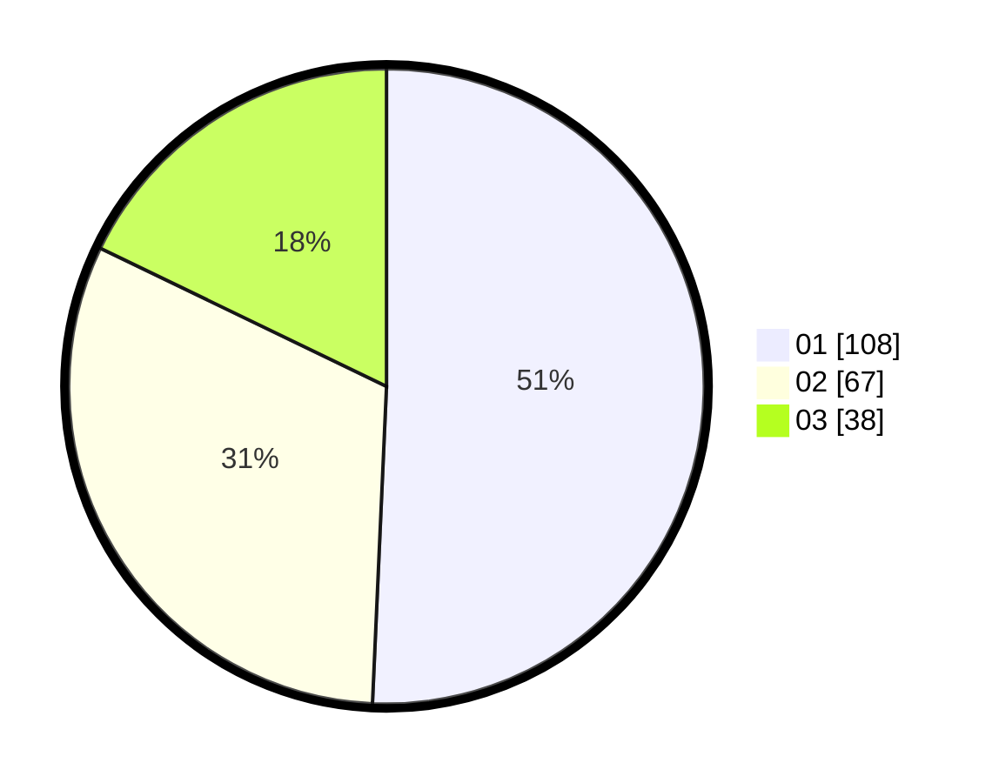

# Hasil

Hasil perolehan suara paslon dapat dilihat pada file paslon-01.txt, paslon-02.txt, dan paslon-03.txt.

Jika tidak ada, artinya data tersebut belum ada pada SIREKAP.

## Perolehan Suara

 * Paslon 01: **108**.
 * Paslon 02: **67**.
 * Paslon 03: **38**.

## Foto C Plano

https://sirekap-obj-formc.kpu.go.id/8580/pemilu/ppwp/31/74/04/10/06/3174041006089-20240214-211743--b2e080d3-3f39-4976-85ec-6e13814ba62e.jpg

https://sirekap-obj-formc.kpu.go.id/8580/pemilu/ppwp/31/74/04/10/06/3174041006089-20240214-212051--2405038f-bf0d-4d06-b0a5-6f5e01920dd1.jpg

https://sirekap-obj-formc.kpu.go.id/8580/pemilu/ppwp/31/74/04/10/06/3174041006089-20240214-212228--ed504316-1b91-4856-b256-1a26d14da290.jpg

## DATA PEMILIH TETAP

Jumlah pemilih dalam DPT: **249**.
 * L: **116**.
 * P: **133**.

## DATA PENGGUNA HAK PILIH

Jumlah pengguna hak pilih dalam DPT: **210**.
 * L: **100**.
 * P: **110**.

Jumlah pengguna hak pilih dalam DPTb: **7**.
 * L: **0**.
 * P: **7**.

Jumlah pengguna hak pilih dalam DPK: **0**.
 * L: **0**.
 * P: **0**.

Jumlah pengguna hak pilih: **217**.
 * L: **100**.
 * P: **117**.

## JUMLAH SUARA SAH DAN TIDAK SAH

JUMLAH SELURUH SUARA SAH: **213**.

JUMLAH SUARA TIDAK SAH: **4**.

JUMLAH SELURUH SUARA SAH DAN SUARA TIDAK SAH: **217**.
