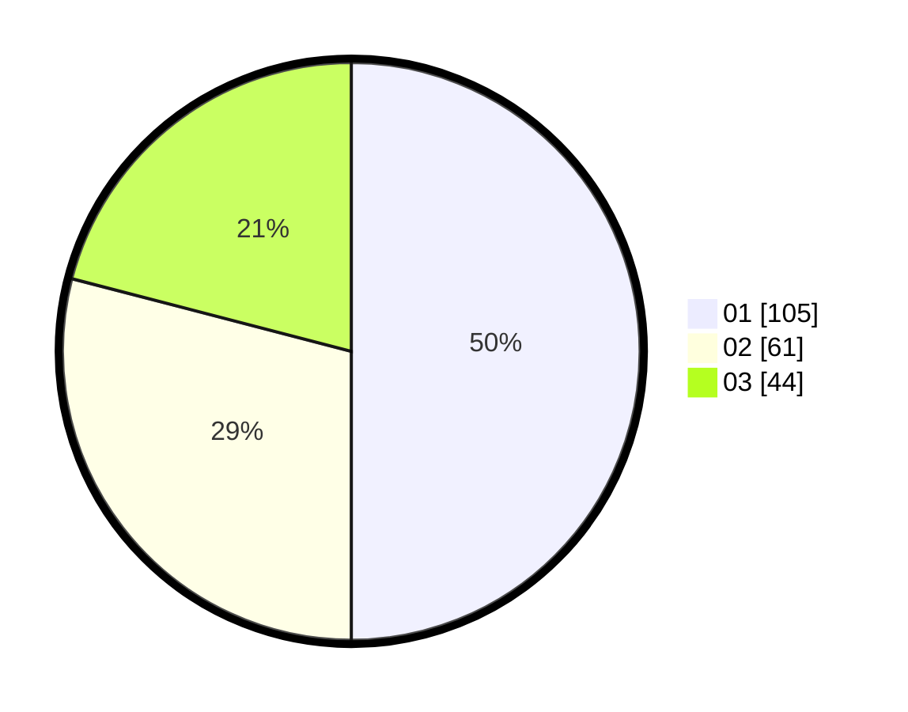

# Hasil

Hasil perolehan suara paslon dapat dilihat pada file paslon-01.txt, paslon-02.txt, dan paslon-03.txt.

Jika tidak ada, artinya data tersebut belum ada pada SIREKAP.

## Perolehan Suara

 * Paslon 01: **105**.
 * Paslon 02: **61**.
 * Paslon 03: **44**.

## Foto C Plano

https://sirekap-obj-formc.kpu.go.id/004a/pemilu/ppwp/31/74/04/10/06/3174041006090-20240214-204213--fd70d4e3-183e-42ce-abb0-8fa712e0ed7a.jpg

https://sirekap-obj-formc.kpu.go.id/004a/pemilu/ppwp/31/74/04/10/06/3174041006090-20240214-194511--cfb426fd-75b6-4e6a-bdf7-21226b5e00d2.jpg

https://sirekap-obj-formc.kpu.go.id/004a/pemilu/ppwp/31/74/04/10/06/3174041006090-20240214-194613--d895c408-6cf1-4d10-9bcc-90af24225748.jpg
