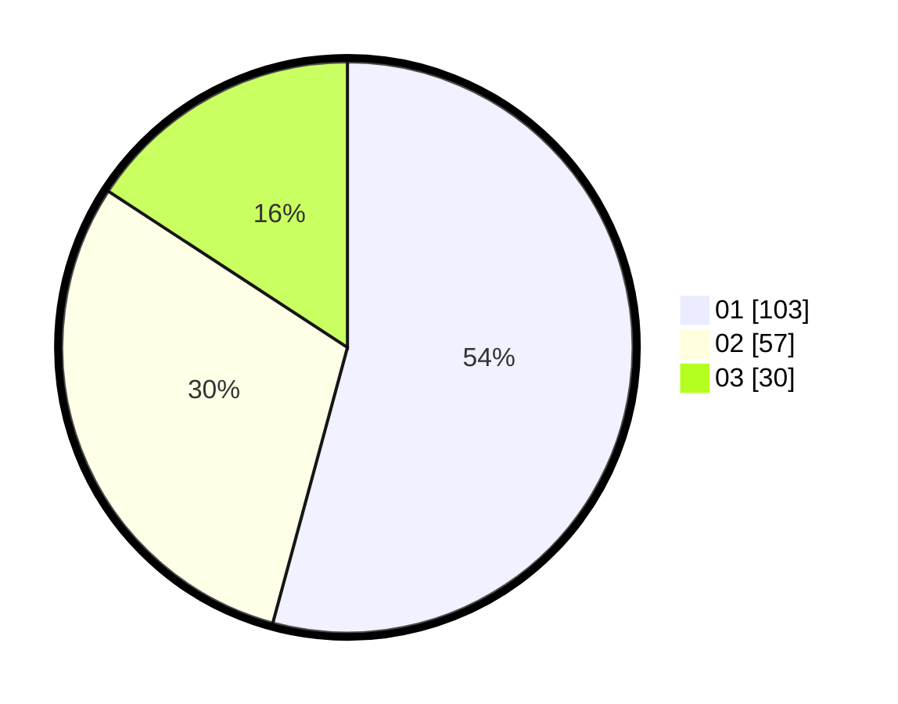

# Hasil

Hasil perolehan suara paslon dapat dilihat pada file paslon-01.txt, paslon-02.txt, dan paslon-03.txt.

Jika tidak ada, artinya data tersebut belum ada pada SIREKAP.

## Perolehan Suara

 * Paslon 01: **103**.
 * Paslon 02: **57**.
 * Paslon 03: **30**.

## Foto C Plano

https://sirekap-obj-formc.kpu.go.id/b3c0/pemilu/ppwp/31/74/04/10/06/3174041006100-20240214-204253--a5575667-9f66-4333-a227-fb12b214af59.jpg

https://sirekap-obj-formc.kpu.go.id/b3c0/pemilu/ppwp/31/74/04/10/06/3174041006100-20240214-211841--ba37602c-9934-40b2-97ee-947d29431a3f.jpg

https://sirekap-obj-formc.kpu.go.id/b3c0/pemilu/ppwp/31/74/04/10/06/3174041006100-20240214-211321--3dc8dd2b-8fd4-40f4-9a60-7affabd17bb7.jpg

## DATA PEMILIH TETAP

Jumlah pemilih dalam DPT: **231**.
 * L: **115**.
 * P: **116**.

## DATA PENGGUNA HAK PILIH

Jumlah pengguna hak pilih dalam DPT: **186**.
 * L: **89**.
 * P: **97**.

Jumlah pengguna hak pilih dalam DPTb: **5**.
 * L: **2**.
 * P: **3**.

Jumlah pengguna hak pilih dalam DPK: **3**.
 * L: **2**.
 * P: **1**.

Jumlah pengguna hak pilih: **194**.
 * L: **93**.
 * P: **101**.

## JUMLAH SUARA SAH DAN TIDAK SAH

JUMLAH SELURUH SUARA SAH: **190**.

JUMLAH SUARA TIDAK SAH: **4**.

JUMLAH SELURUH SUARA SAH DAN SUARA TIDAK SAH: **194**.
