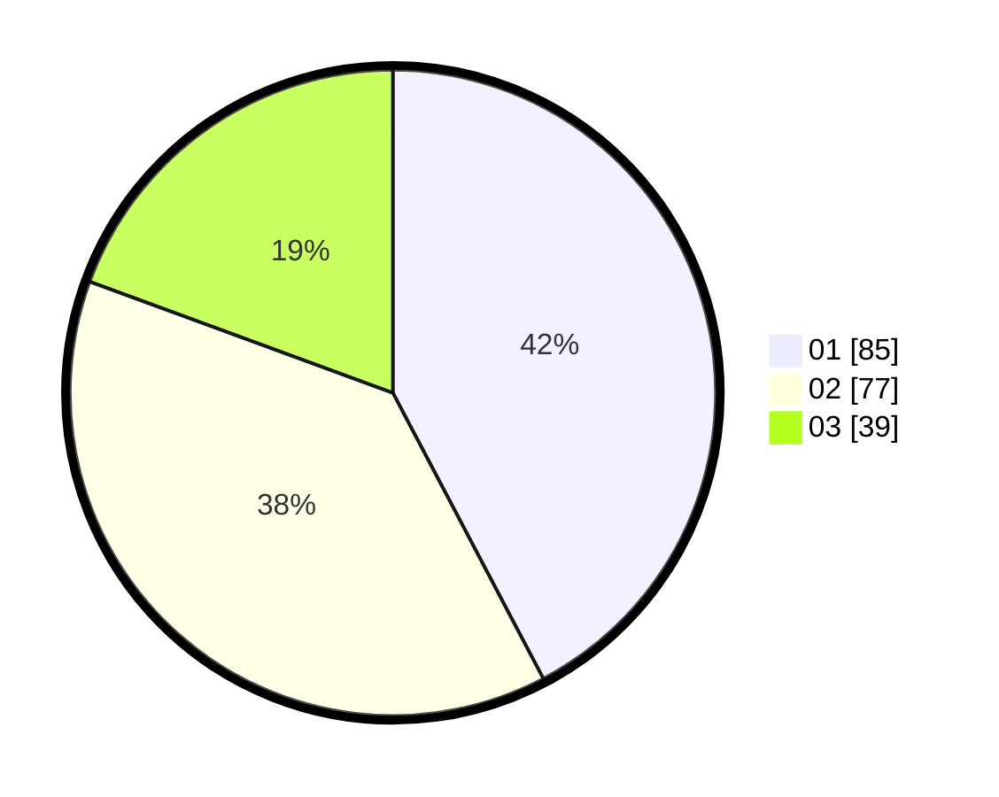

# Hasil

Hasil perolehan suara paslon dapat dilihat pada file paslon-01.txt, paslon-02.txt, dan paslon-03.txt.

Jika tidak ada, artinya data tersebut belum ada pada SIREKAP.

## Perolehan Suara

 * Paslon 01: **85**.
 * Paslon 02: **77**.
 * Paslon 03: **39**.

## Foto C Plano

https://sirekap-obj-formc.kpu.go.id/6615/pemilu/ppwp/31/74/04/10/06/3174041006116-20240214-220329--2eacbd67-b7d4-4f69-be15-07f1408804fe.jpg

https://sirekap-obj-formc.kpu.go.id/6615/pemilu/ppwp/31/74/04/10/06/3174041006116-20240217-062137--d40015d5-75f0-4d53-b445-0024a8c5d2a8.jpg

https://sirekap-obj-formc.kpu.go.id/6615/pemilu/ppwp/31/74/04/10/06/3174041006116-20240214-220850--0343705c-7c22-462f-9144-17f9e68e3d19.jpg

## DATA PEMILIH TETAP

Jumlah pemilih dalam DPT: **251**.
 * L: **128**.
 * P: **123**.

## DATA PENGGUNA HAK PILIH

Jumlah pengguna hak pilih dalam DPT: **194**.
 * L: **99**.
 * P: **95**.

Jumlah pengguna hak pilih dalam DPTb: **3**.
 * L: **2**.
 * P: **1**.

Jumlah pengguna hak pilih dalam DPK: **5**.
 * L: **2**.
 * P: **3**.

Jumlah pengguna hak pilih: **202**.
 * L: **103**.
 * P: **99**.

## JUMLAH SUARA SAH DAN TIDAK SAH

JUMLAH SELURUH SUARA SAH: **201**.

JUMLAH SUARA TIDAK SAH: **1**.

JUMLAH SELURUH SUARA SAH DAN SUARA TIDAK SAH: **202**.
