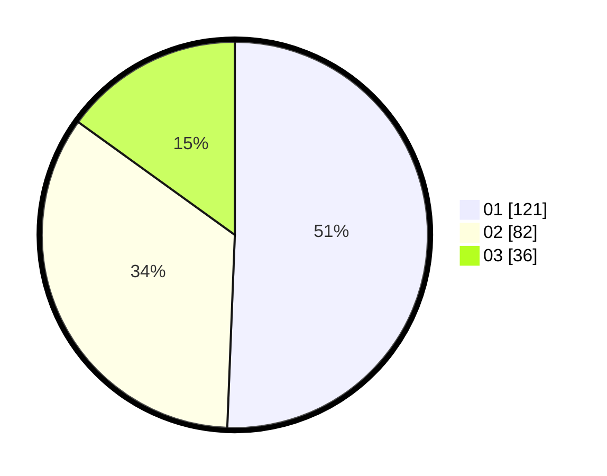

# Hasil

Hasil perolehan suara paslon dapat dilihat pada file paslon-01.txt, paslon-02.txt, dan paslon-03.txt.

Jika tidak ada, artinya data tersebut belum ada pada SIREKAP.

## Perolehan Suara

 * Paslon 01: **121**.
 * Paslon 02: **82**.
 * Paslon 03: **36**.

## Foto C Plano

https://sirekap-obj-formc.kpu.go.id/4620/pemilu/ppwp/31/74/04/10/06/3174041006120-20240214-155823--66586d73-04c4-4311-9ab5-1330dfa8631c.jpg

https://sirekap-obj-formc.kpu.go.id/4620/pemilu/ppwp/31/74/04/10/06/3174041006120-20240214-160106--a0e36cc6-58bf-4e56-9fc1-3b2dbfeb5c4e.jpg

https://sirekap-obj-formc.kpu.go.id/4620/pemilu/ppwp/31/74/04/10/06/3174041006120-20240214-160106--197b46a1-785d-45f6-af1f-523968a89643.jpg

## DATA PEMILIH TETAP

Jumlah pemilih dalam DPT: **290**.
 * L: **153**.
 * P: **137**.

## DATA PENGGUNA HAK PILIH

Jumlah pengguna hak pilih dalam DPT: **228**.
 * L: **125**.
 * P: **103**.

Jumlah pengguna hak pilih dalam DPTb: **10**.
 * L: **7**.
 * P: **3**.

Jumlah pengguna hak pilih dalam DPK: **3**.
 * L: **1**.
 * P: **2**.

Jumlah pengguna hak pilih: **241**.
 * L: **133**.
 * P: **108**.

## JUMLAH SUARA SAH DAN TIDAK SAH

JUMLAH SELURUH SUARA SAH: **239**.

JUMLAH SUARA TIDAK SAH: **2**.

JUMLAH SELURUH SUARA SAH DAN SUARA TIDAK SAH: **241**.
