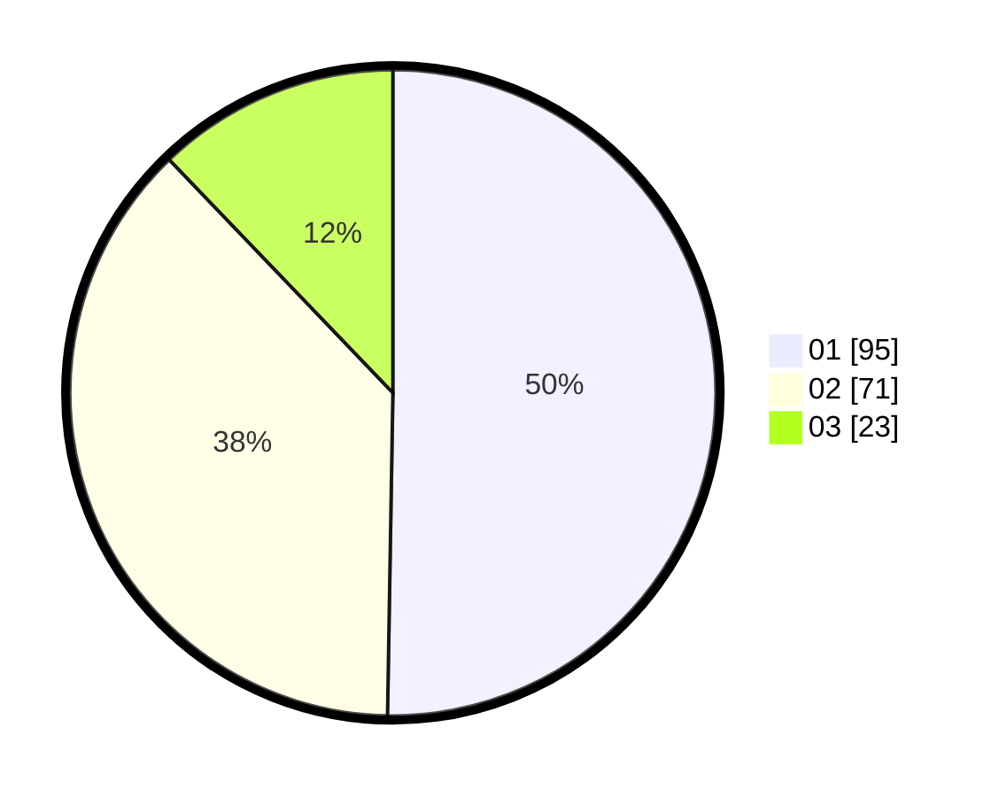

# Hasil

Hasil perolehan suara paslon dapat dilihat pada file paslon-01.txt, paslon-02.txt, dan paslon-03.txt.

Jika tidak ada, artinya data tersebut belum ada pada SIREKAP.

## Perolehan Suara

 * Paslon 01: **95**.
 * Paslon 02: **71**.
 * Paslon 03: **23**.

## Foto C Plano

https://sirekap-obj-formc.kpu.go.id/28b7/pemilu/ppwp/31/74/04/10/06/3174041006125-20240214-203143--f21e3690-edf8-4abb-ad7f-782cd345e799.jpg

https://sirekap-obj-formc.kpu.go.id/28b7/pemilu/ppwp/31/74/04/10/06/3174041006125-20240214-211434--409080c1-8c92-40fc-88b6-06606fee918e.jpg

https://sirekap-obj-formc.kpu.go.id/28b7/pemilu/ppwp/31/74/04/10/06/3174041006125-20240214-162231--ed21697f-9fde-4b37-9bfd-a987862fce60.jpg

## DATA PEMILIH TETAP

Jumlah pemilih dalam DPT: **236**.
 * L: **120**.
 * P: **116**.

## DATA PENGGUNA HAK PILIH

Jumlah pengguna hak pilih dalam DPT: **189**.
 * L: **100**.
 * P: **89**.

Jumlah pengguna hak pilih dalam DPTb: **0**.
 * L: **0**.
 * P: **0**.

Jumlah pengguna hak pilih dalam DPK: **1**.
 * L: **1**.
 * P: **0**.

Jumlah pengguna hak pilih: **190**.
 * L: **101**.
 * P: **89**.

## JUMLAH SUARA SAH DAN TIDAK SAH

JUMLAH SELURUH SUARA SAH: **189**.

JUMLAH SUARA TIDAK SAH: **1**.

JUMLAH SELURUH SUARA SAH DAN SUARA TIDAK SAH: **190**.
