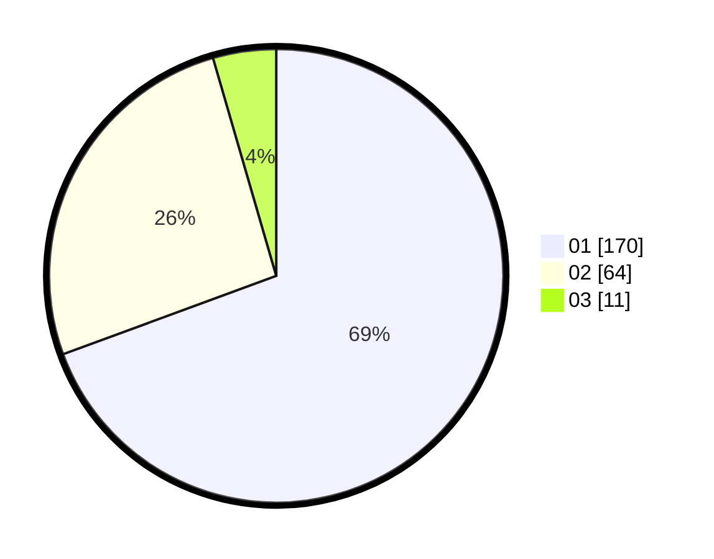

# Hasil

Hasil perolehan suara paslon dapat dilihat pada file paslon-01.txt, paslon-02.txt, dan paslon-03.txt.

Jika tidak ada, artinya data tersebut belum ada pada SIREKAP.

## Perolehan Suara

 * Paslon 01: **170**.
 * Paslon 02: **64**.
 * Paslon 03: **11**.

## Foto C Plano

https://sirekap-obj-formc.kpu.go.id/ffbc/pemilu/ppwp/31/74/04/10/06/3174041006126-20240217-101143--e684b202-b0f1-4d58-b046-d9a432b0cca3.jpg

https://sirekap-obj-formc.kpu.go.id/ffbc/pemilu/ppwp/31/74/04/10/06/3174041006126-20240215-020259--ce1c2bf7-1b9a-48d5-ad4f-51666326a46d.jpg

https://sirekap-obj-formc.kpu.go.id/ffbc/pemilu/ppwp/31/74/04/10/06/3174041006126-20240215-020408--82d73d69-f443-4c5b-84d3-8ebe78612208.jpg
