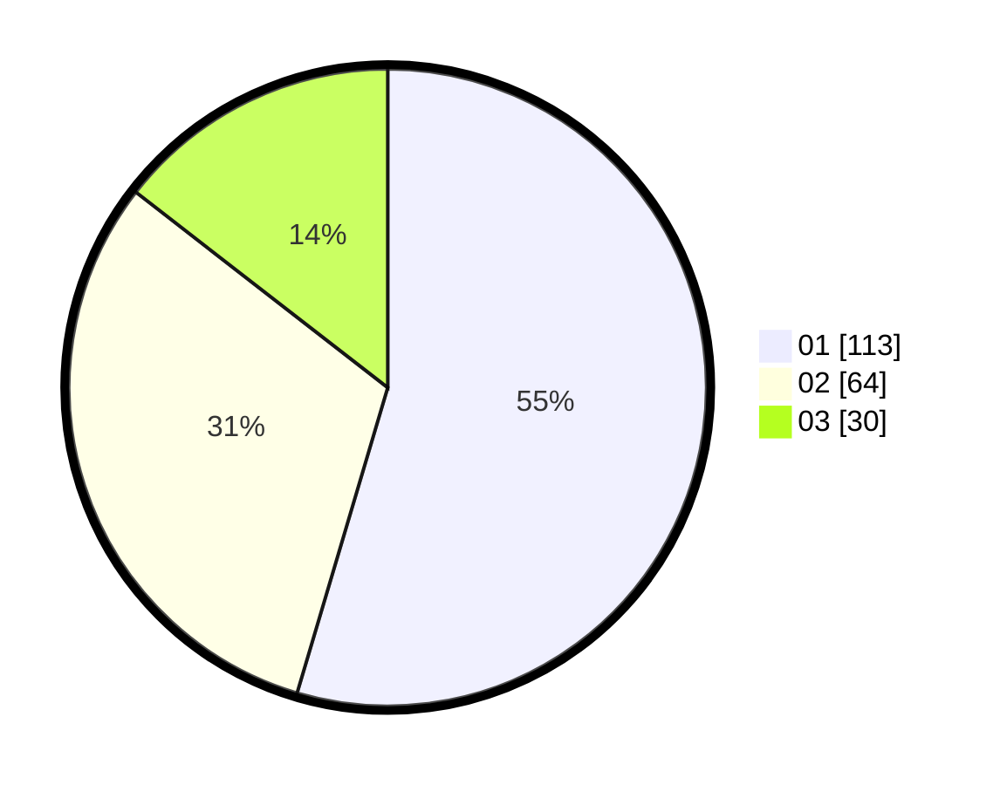

# Hasil

Hasil perolehan suara paslon dapat dilihat pada file paslon-01.txt, paslon-02.txt, dan paslon-03.txt.

Jika tidak ada, artinya data tersebut belum ada pada SIREKAP.

## Perolehan Suara

 * Paslon 01: **113**.
 * Paslon 02: **64**.
 * Paslon 03: **30**.

## Foto C Plano

https://sirekap-obj-formc.kpu.go.id/ac76/pemilu/ppwp/31/74/04/10/07/3174041007008-20240214-221632--1779c85f-6844-49ce-af82-e0245c7526bc.jpg

https://sirekap-obj-formc.kpu.go.id/ac76/pemilu/ppwp/31/74/04/10/07/3174041007008-20240214-193639--53107373-64a6-4fb0-839e-8a3e2022efd7.jpg

https://sirekap-obj-formc.kpu.go.id/ac76/pemilu/ppwp/31/74/04/10/07/3174041007008-20240214-221838--e50a30ca-40ff-4b04-9ddd-bdea04886803.jpg
