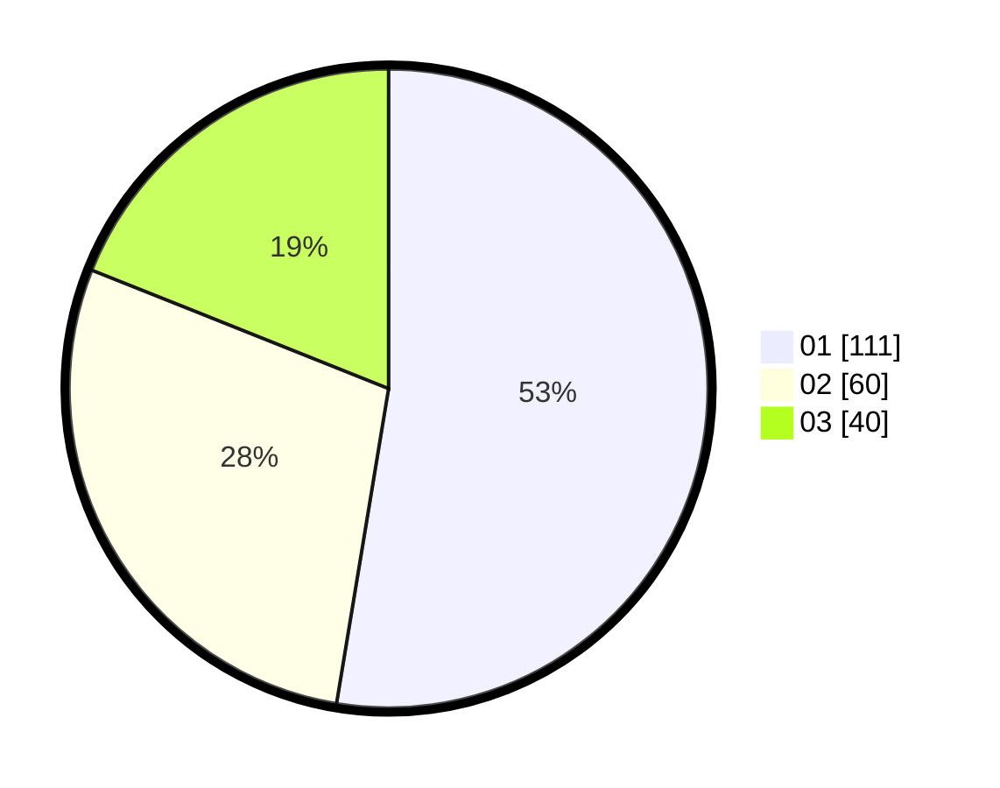

# Hasil

Hasil perolehan suara paslon dapat dilihat pada file paslon-01.txt, paslon-02.txt, dan paslon-03.txt.

Jika tidak ada, artinya data tersebut belum ada pada SIREKAP.

## Perolehan Suara

 * Paslon 01: **111**.
 * Paslon 02: **60**.
 * Paslon 03: **40**.

## Foto C Plano

https://sirekap-obj-formc.kpu.go.id/e280/pemilu/ppwp/31/74/04/10/07/3174041007021-20240214-195042--6df4bf59-63f1-4399-9585-72b1e09688d5.jpg

https://sirekap-obj-formc.kpu.go.id/e280/pemilu/ppwp/31/74/04/10/07/3174041007021-20240214-205655--2b76d8bc-bbf4-46a2-b9de-2ef58eee0374.jpg

https://sirekap-obj-formc.kpu.go.id/e280/pemilu/ppwp/31/74/04/10/07/3174041007021-20240214-193257--4bc42283-6ecb-4ad9-8e35-bd5f58b0557c.jpg

## DATA PEMILIH TETAP

Jumlah pemilih dalam DPT: **248**.
 * L: **117**.
 * P: **131**.

## DATA PENGGUNA HAK PILIH

Jumlah pengguna hak pilih dalam DPT: **196**.
 * L: **95**.
 * P: **101**.

Jumlah pengguna hak pilih dalam DPTb: **14**.
 * L: **5**.
 * P: **9**.

Jumlah pengguna hak pilih dalam DPK: **3**.
 * L: **0**.
 * P: **3**.

Jumlah pengguna hak pilih: **213**.
 * L: **100**.
 * P: **113**.

## JUMLAH SUARA SAH DAN TIDAK SAH

JUMLAH SELURUH SUARA SAH: **211**.

JUMLAH SUARA TIDAK SAH: **2**.

JUMLAH SELURUH SUARA SAH DAN SUARA TIDAK SAH: **213**.
