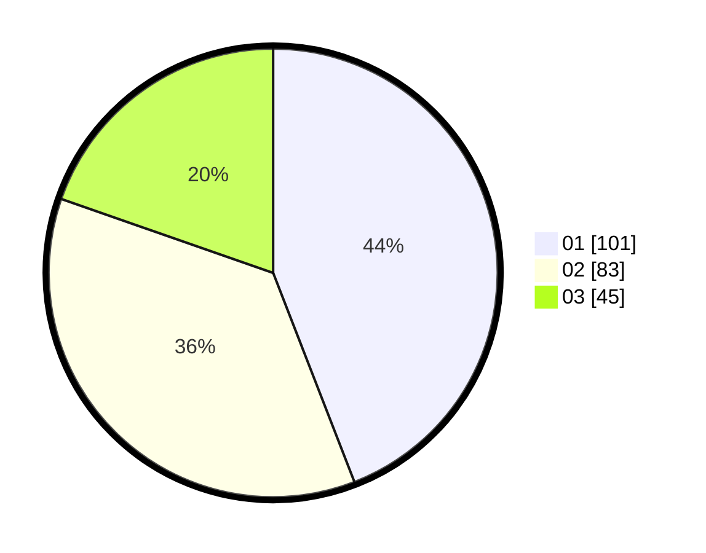

# Hasil

Hasil perolehan suara paslon dapat dilihat pada file paslon-01.txt, paslon-02.txt, dan paslon-03.txt.

Jika tidak ada, artinya data tersebut belum ada pada SIREKAP.

## Perolehan Suara

 * Paslon 01: **101**.
 * Paslon 02: **83**.
 * Paslon 03: **45**.

## Foto C Plano

https://sirekap-obj-formc.kpu.go.id/2d4b/pemilu/ppwp/31/74/04/10/07/3174041007026-20240214-212550--50c0fd88-b191-4dcc-8865-997e5379d794.jpg

https://sirekap-obj-formc.kpu.go.id/2d4b/pemilu/ppwp/31/74/04/10/07/3174041007026-20240214-203835--92120bac-6b43-49da-a156-95d1c7aec7db.jpg

https://sirekap-obj-formc.kpu.go.id/2d4b/pemilu/ppwp/31/74/04/10/07/3174041007026-20240214-203957--ba7027f2-efae-4f36-97f2-c57599ae0f01.jpg
