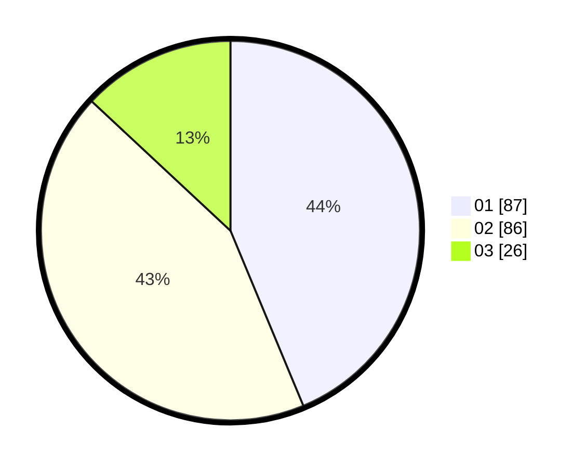

# Hasil

Hasil perolehan suara paslon dapat dilihat pada file paslon-01.txt, paslon-02.txt, dan paslon-03.txt.

Jika tidak ada, artinya data tersebut belum ada pada SIREKAP.

## Perolehan Suara

 * Paslon 01: **87**.
 * Paslon 02: **86**.
 * Paslon 03: **26**.

## Foto C Plano

https://sirekap-obj-formc.kpu.go.id/d9f6/pemilu/ppwp/31/74/04/10/07/3174041007028-20240214-155732--5c51167e-868c-4021-893c-0ddccee120f3.jpg

https://sirekap-obj-formc.kpu.go.id/d9f6/pemilu/ppwp/31/74/04/10/07/3174041007028-20240214-155904--3c96eb92-fb73-4a2d-bdbd-c26b2000902d.jpg

https://sirekap-obj-formc.kpu.go.id/d9f6/pemilu/ppwp/31/74/04/10/07/3174041007028-20240214-155626--ff4bc682-02e2-456c-b8af-00305c45fa87.jpg

## DATA PEMILIH TETAP

Jumlah pemilih dalam DPT: **222**.
 * L: **108**.
 * P: **114**.

## DATA PENGGUNA HAK PILIH

Jumlah pengguna hak pilih dalam DPT: **187**.
 * L: **87**.
 * P: **100**.

Jumlah pengguna hak pilih dalam DPTb: **9**.
 * L: **3**.
 * P: **6**.

Jumlah pengguna hak pilih dalam DPK: **5**.
 * L: **2**.
 * P: **3**.

Jumlah pengguna hak pilih: **201**.
 * L: **92**.
 * P: **109**.

## JUMLAH SUARA SAH DAN TIDAK SAH

JUMLAH SELURUH SUARA SAH: **199**.

JUMLAH SUARA TIDAK SAH: **2**.

JUMLAH SELURUH SUARA SAH DAN SUARA TIDAK SAH: **201**.
