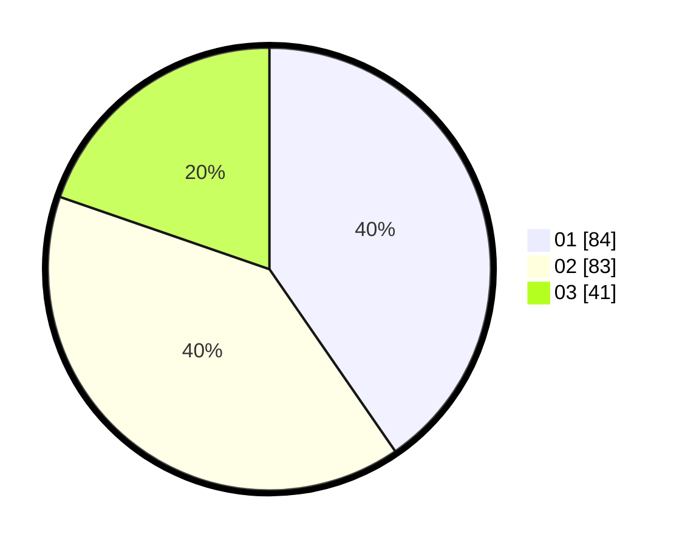

# Hasil

Hasil perolehan suara paslon dapat dilihat pada file paslon-01.txt, paslon-02.txt, dan paslon-03.txt.

Jika tidak ada, artinya data tersebut belum ada pada SIREKAP.

## Perolehan Suara

 * Paslon 01: **84**.
 * Paslon 02: **83**.
 * Paslon 03: **41**.

## Foto C Plano

https://sirekap-obj-formc.kpu.go.id/7f0b/pemilu/ppwp/31/74/04/10/07/3174041007043-20240214-192354--5f8d74f4-bbcd-4c3d-b1b2-e4a259163bc8.jpg

https://sirekap-obj-formc.kpu.go.id/7f0b/pemilu/ppwp/31/74/04/10/07/3174041007043-20240214-192505--97045a1c-61aa-4b2f-a1e3-1f3a762563f7.jpg

https://sirekap-obj-formc.kpu.go.id/7f0b/pemilu/ppwp/31/74/04/10/07/3174041007043-20240214-192608--e2406884-8e65-4633-a384-4a0ac447c448.jpg

## DATA PEMILIH TETAP

Jumlah pemilih dalam DPT: **252**.
 * L: **124**.
 * P: **128**.

## DATA PENGGUNA HAK PILIH

Jumlah pengguna hak pilih dalam DPT: **200**.
 * L: **97**.
 * P: **103**.

Jumlah pengguna hak pilih dalam DPTb: **3**.
 * L: **1**.
 * P: **2**.

Jumlah pengguna hak pilih dalam DPK: **6**.
 * L: **2**.
 * P: **4**.

Jumlah pengguna hak pilih: **209**.
 * L: **100**.
 * P: **109**.

## JUMLAH SUARA SAH DAN TIDAK SAH

JUMLAH SELURUH SUARA SAH: **208**.

JUMLAH SUARA TIDAK SAH: **1**.

JUMLAH SELURUH SUARA SAH DAN SUARA TIDAK SAH: **209**.
