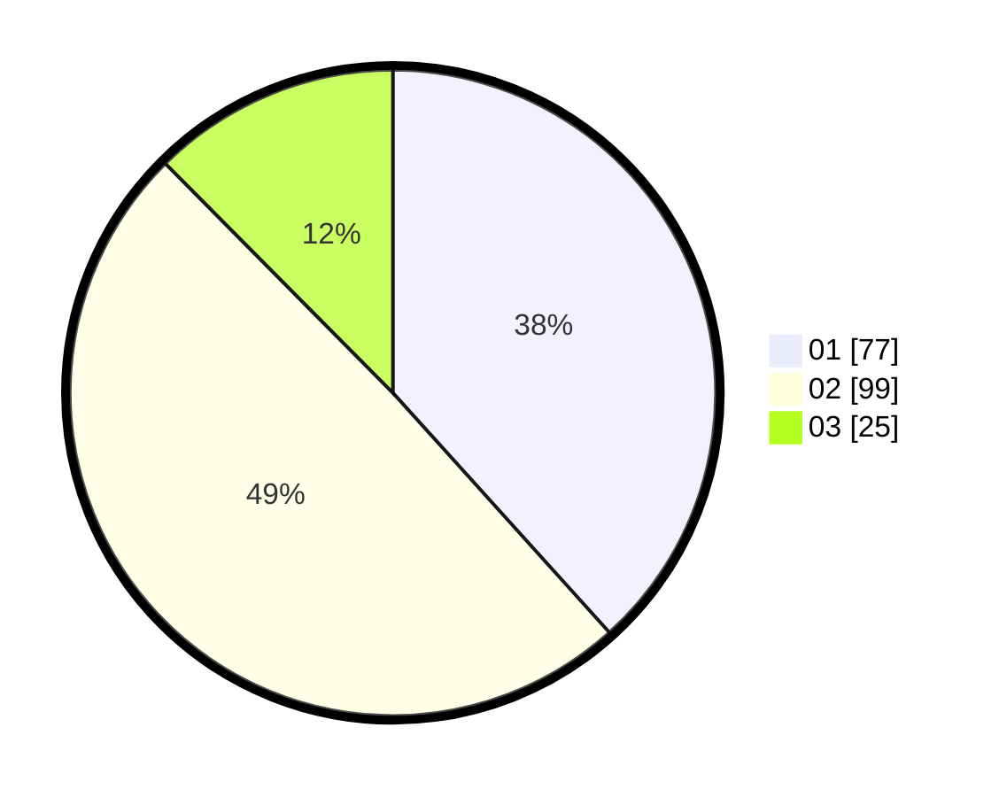

# Hasil

Hasil perolehan suara paslon dapat dilihat pada file paslon-01.txt, paslon-02.txt, dan paslon-03.txt.

Jika tidak ada, artinya data tersebut belum ada pada SIREKAP.

## Perolehan Suara

 * Paslon 01: **77**.
 * Paslon 02: **99**.
 * Paslon 03: **25**.

## Foto C Plano

https://sirekap-obj-formc.kpu.go.id/8721/pemilu/ppwp/31/74/04/10/07/3174041007045-20240214-235835--912f8b6f-7f88-4dbd-9955-448d79b2b64d.jpg

https://sirekap-obj-formc.kpu.go.id/8721/pemilu/ppwp/31/74/04/10/07/3174041007045-20240215-000002--777c0eae-9ed1-4053-bdac-dfe4d1ff89fa.jpg

https://sirekap-obj-formc.kpu.go.id/8721/pemilu/ppwp/31/74/04/10/07/3174041007045-20240215-000208--4280711e-1e1a-4c8a-b150-519eeecd2251.jpg
