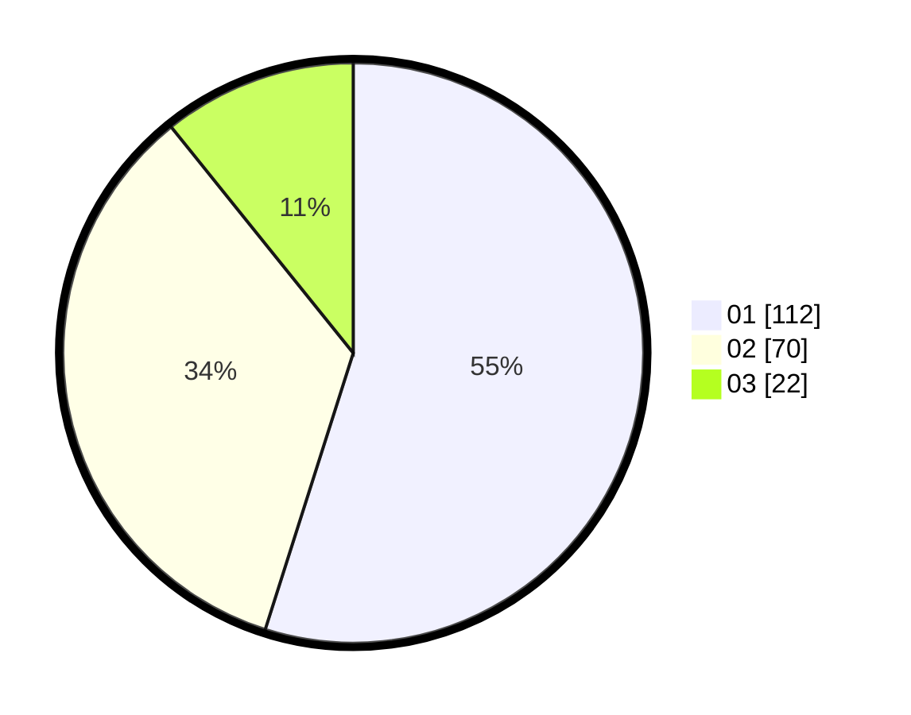

# Hasil

Hasil perolehan suara paslon dapat dilihat pada file paslon-01.txt, paslon-02.txt, dan paslon-03.txt.

Jika tidak ada, artinya data tersebut belum ada pada SIREKAP.

## Perolehan Suara

 * Paslon 01: **112**.
 * Paslon 02: **70**.
 * Paslon 03: **22**.

## Foto C Plano

https://sirekap-obj-formc.kpu.go.id/eaf4/pemilu/ppwp/31/74/04/10/07/3174041007049-20240214-215738--9d119cdd-ac90-4960-824b-cb01dd716ad0.jpg

https://sirekap-obj-formc.kpu.go.id/eaf4/pemilu/ppwp/31/74/04/10/07/3174041007049-20240214-215905--da775e47-49aa-40eb-8c62-7787ca21efc9.jpg

https://sirekap-obj-formc.kpu.go.id/eaf4/pemilu/ppwp/31/74/04/10/07/3174041007049-20240214-220009--2a9d08a7-17fe-4c74-aff9-5808b31abfaa.jpg
