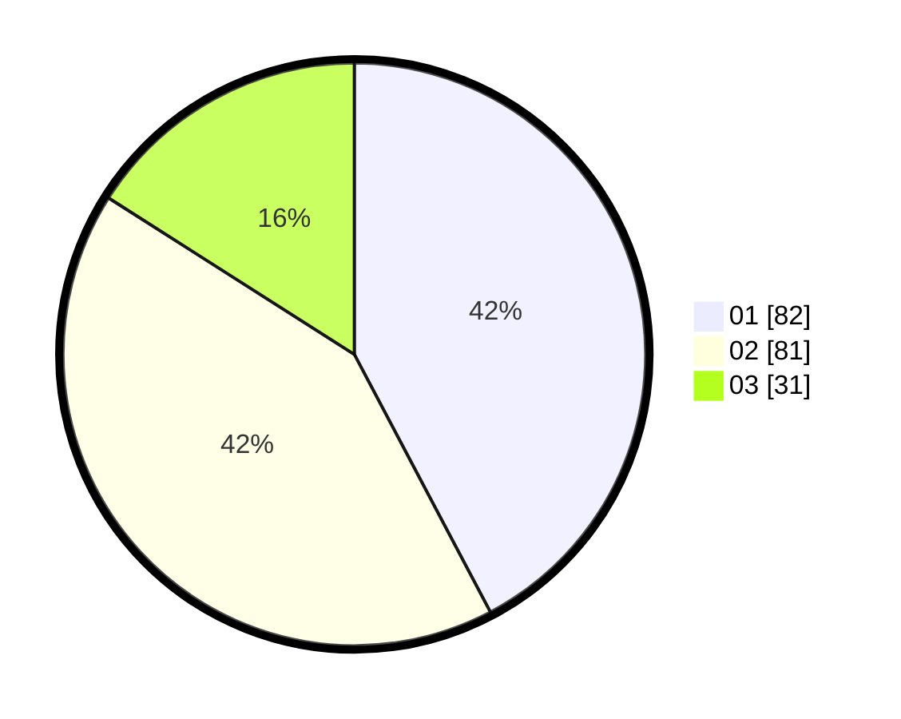

# Hasil

Hasil perolehan suara paslon dapat dilihat pada file paslon-01.txt, paslon-02.txt, dan paslon-03.txt.

Jika tidak ada, artinya data tersebut belum ada pada SIREKAP.

## Perolehan Suara

 * Paslon 01: **82**.
 * Paslon 02: **81**.
 * Paslon 03: **31**.

## Foto C Plano

https://sirekap-obj-formc.kpu.go.id/804d/pemilu/ppwp/31/74/04/10/07/3174041007051-20240214-233120--4826f1ab-df87-4834-98ba-f0ee3410f8d2.jpg

https://sirekap-obj-formc.kpu.go.id/804d/pemilu/ppwp/31/74/04/10/07/3174041007051-20240214-185025--5958b4ba-ddb5-4ad8-97dc-98f0dd39a293.jpg

https://sirekap-obj-formc.kpu.go.id/804d/pemilu/ppwp/31/74/04/10/07/3174041007051-20240214-185159--bd895457-6471-4e8e-a257-5ca32b87ce7d.jpg
