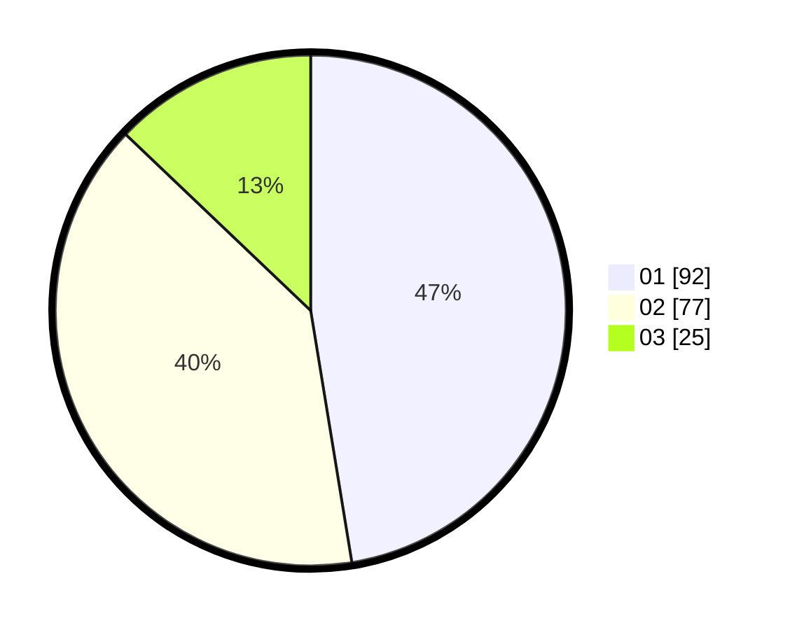

# Hasil

Hasil perolehan suara paslon dapat dilihat pada file paslon-01.txt, paslon-02.txt, dan paslon-03.txt.

Jika tidak ada, artinya data tersebut belum ada pada SIREKAP.

## Perolehan Suara

 * Paslon 01: **92**.
 * Paslon 02: **77**.
 * Paslon 03: **25**.

## Foto C Plano

https://sirekap-obj-formc.kpu.go.id/1930/pemilu/ppwp/31/74/04/10/07/3174041007056-20240215-204549--a6b3a4de-e2ca-457a-8c4a-b6ebf0911ae7.jpg

https://sirekap-obj-formc.kpu.go.id/1930/pemilu/ppwp/31/74/04/10/07/3174041007056-20240214-191321--f512d53e-d95c-4526-9350-31a0a552571c.jpg

https://sirekap-obj-formc.kpu.go.id/1930/pemilu/ppwp/31/74/04/10/07/3174041007056-20240214-191423--5209b3ca-c900-47f6-821a-83fcc5326854.jpg

## DATA PEMILIH TETAP

Jumlah pemilih dalam DPT: **256**.
 * L: **127**.
 * P: **129**.

## DATA PENGGUNA HAK PILIH

Jumlah pengguna hak pilih dalam DPT: **199**.
 * L: **104**.
 * P: **95**.

Jumlah pengguna hak pilih dalam DPTb: **0**.
 * L: **0**.
 * P: **0**.

Jumlah pengguna hak pilih dalam DPK: **2**.
 * L: **1**.
 * P: **1**.

Jumlah pengguna hak pilih: **201**.
 * L: **105**.
 * P: **95**.

## JUMLAH SUARA SAH DAN TIDAK SAH

JUMLAH SELURUH SUARA SAH: **194**.

JUMLAH SUARA TIDAK SAH: **7**.

JUMLAH SELURUH SUARA SAH DAN SUARA TIDAK SAH: **201**.
