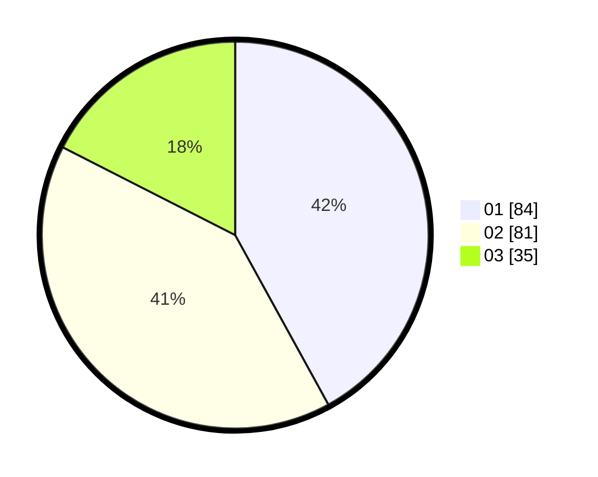

# Hasil

Hasil perolehan suara paslon dapat dilihat pada file paslon-01.txt, paslon-02.txt, dan paslon-03.txt.

Jika tidak ada, artinya data tersebut belum ada pada SIREKAP.

## Perolehan Suara

 * Paslon 01: **84**.
 * Paslon 02: **81**.
 * Paslon 03: **35**.

## Foto C Plano

https://sirekap-obj-formc.kpu.go.id/783a/pemilu/ppwp/31/74/04/10/07/3174041007057-20240214-160107--a9d7b231-8c9f-4071-bdc6-39385bf9c8bc.jpg

https://sirekap-obj-formc.kpu.go.id/783a/pemilu/ppwp/31/74/04/10/07/3174041007057-20240214-155605--678fb7cd-10ab-41fd-a3a0-587ccf788092.jpg

https://sirekap-obj-formc.kpu.go.id/783a/pemilu/ppwp/31/74/04/10/07/3174041007057-20240214-160055--3ea2565d-5a84-42c4-9a8c-be8ef4931572.jpg
