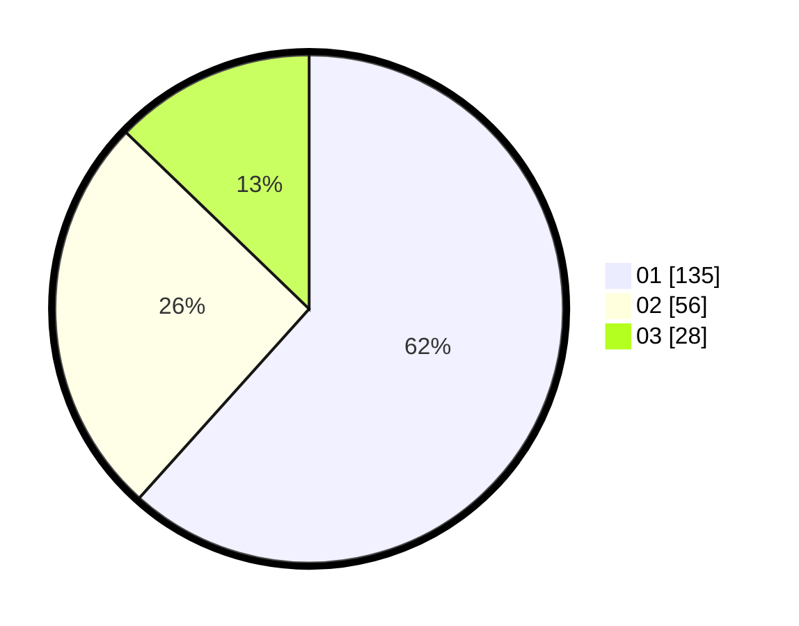

# Hasil

Hasil perolehan suara paslon dapat dilihat pada file paslon-01.txt, paslon-02.txt, dan paslon-03.txt.

Jika tidak ada, artinya data tersebut belum ada pada SIREKAP.

## Perolehan Suara

 * Paslon 01: **135**.
 * Paslon 02: **56**.
 * Paslon 03: **28**.

## Foto C Plano

https://sirekap-obj-formc.kpu.go.id/c203/pemilu/ppwp/31/74/04/10/07/3174041007072-20240214-160102--f05b4ef6-0c71-44b6-a4f8-139bdefccb7f.jpg

https://sirekap-obj-formc.kpu.go.id/c203/pemilu/ppwp/31/74/04/10/07/3174041007072-20240214-162224--4d654f61-ea2b-4ef7-a578-53d927517630.jpg

https://sirekap-obj-formc.kpu.go.id/c203/pemilu/ppwp/31/74/04/10/07/3174041007072-20240214-185846--ac8e0ecb-9ba9-4735-b9c8-8be9478b1cf9.jpg

## DATA PEMILIH TETAP

Jumlah pemilih dalam DPT: **266**.
 * L: **129**.
 * P: **137**.

## DATA PENGGUNA HAK PILIH

Jumlah pengguna hak pilih dalam DPT: **219**.
 * L: **109**.
 * P: **110**.

Jumlah pengguna hak pilih dalam DPTb: **4**.
 * L: **3**.
 * P: **1**.

Jumlah pengguna hak pilih dalam DPK: **3**.
 * L: **2**.
 * P: **1**.

Jumlah pengguna hak pilih: **226**.
 * L: **114**.
 * P: **112**.

## JUMLAH SUARA SAH DAN TIDAK SAH

JUMLAH SELURUH SUARA SAH: **219**.

JUMLAH SUARA TIDAK SAH: **7**.

JUMLAH SELURUH SUARA SAH DAN SUARA TIDAK SAH: **226**.
