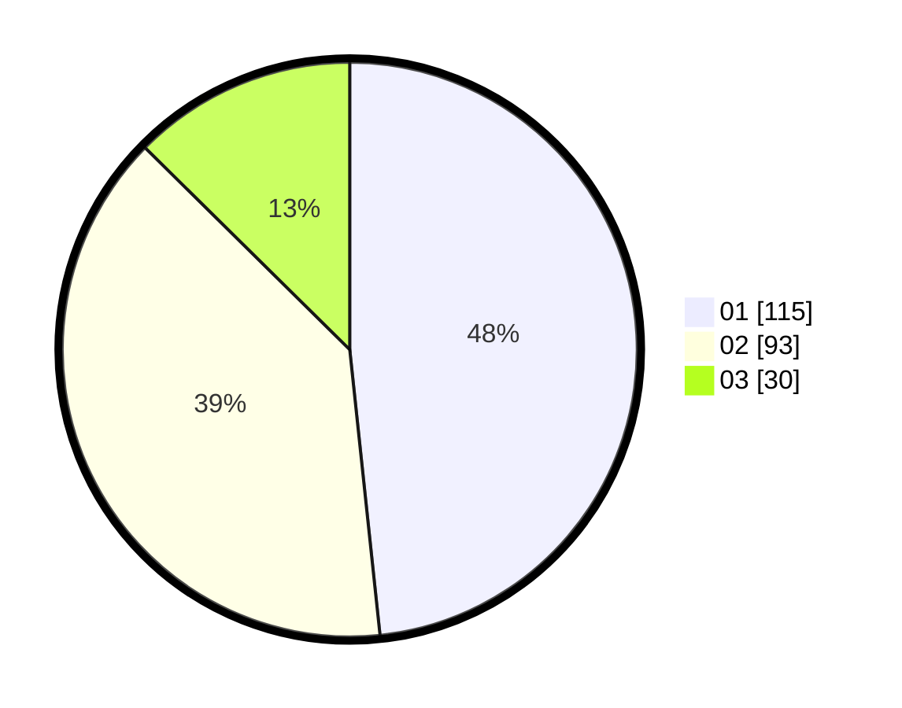

# Hasil

Hasil perolehan suara paslon dapat dilihat pada file paslon-01.txt, paslon-02.txt, dan paslon-03.txt.

Jika tidak ada, artinya data tersebut belum ada pada SIREKAP.

## Perolehan Suara

 * Paslon 01: **115**.
 * Paslon 02: **93**.
 * Paslon 03: **30**.

## Foto C Plano

https://sirekap-obj-formc.kpu.go.id/6af7/pemilu/ppwp/31/74/04/10/07/3174041007075-20240214-212709--b74d9e89-2dd8-403d-a015-78d65e2918ba.jpg

https://sirekap-obj-formc.kpu.go.id/6af7/pemilu/ppwp/31/74/04/10/07/3174041007075-20240214-233237--86b94d26-6f20-42ec-bcde-343569fbf41b.jpg

https://sirekap-obj-formc.kpu.go.id/6af7/pemilu/ppwp/31/74/04/10/07/3174041007075-20240214-194929--8be07a56-d48c-40cd-a23f-423b7d39e93c.jpg

## DATA PEMILIH TETAP

Jumlah pemilih dalam DPT: **290**.
 * L: **143**.
 * P: **147**.

## DATA PENGGUNA HAK PILIH

Jumlah pengguna hak pilih dalam DPT: **229**.
 * L: **108**.
 * P: **121**.

Jumlah pengguna hak pilih dalam DPTb: **9**.
 * L: **5**.
 * P: **4**.

Jumlah pengguna hak pilih dalam DPK: **1**.
 * L: **1**.
 * P: **0**.

Jumlah pengguna hak pilih: **239**.
 * L: **114**.
 * P: **125**.

## JUMLAH SUARA SAH DAN TIDAK SAH

JUMLAH SELURUH SUARA SAH: **238**.

JUMLAH SUARA TIDAK SAH: **1**.

JUMLAH SELURUH SUARA SAH DAN SUARA TIDAK SAH: **239**.
