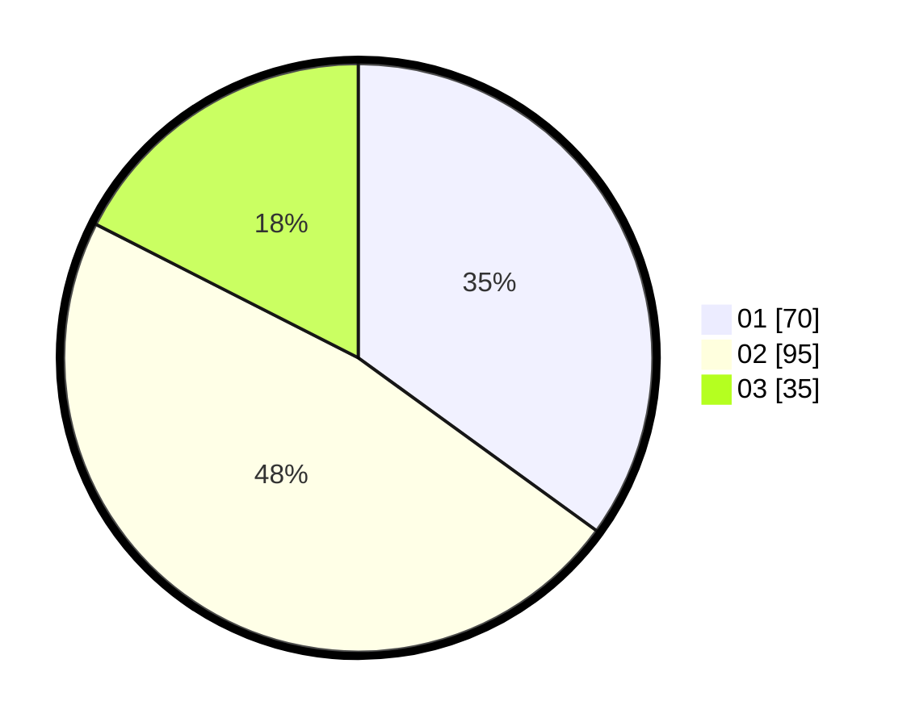

# Hasil

Hasil perolehan suara paslon dapat dilihat pada file paslon-01.txt, paslon-02.txt, dan paslon-03.txt.

Jika tidak ada, artinya data tersebut belum ada pada SIREKAP.

## Perolehan Suara

 * Paslon 01: **70**.
 * Paslon 02: **95**.
 * Paslon 03: **35**.

## Foto C Plano

https://sirekap-obj-formc.kpu.go.id/9e41/pemilu/ppwp/31/74/04/10/07/3174041007080-20240214-224026--4c64a494-22d3-4bcb-9685-b75ef3a0dc38.jpg

https://sirekap-obj-formc.kpu.go.id/9e41/pemilu/ppwp/31/74/04/10/07/3174041007080-20240214-224047--5af3f4bc-36e8-42e8-bf90-546bdcef0a0e.jpg

https://sirekap-obj-formc.kpu.go.id/9e41/pemilu/ppwp/31/74/04/10/07/3174041007080-20240214-224036--04713607-65d3-4d09-b1d8-715278e183ee.jpg

## DATA PEMILIH TETAP

Jumlah pemilih dalam DPT: **265**.
 * L: **132**.
 * P: **133**.

## DATA PENGGUNA HAK PILIH

Jumlah pengguna hak pilih dalam DPT: **197**.
 * L: **94**.
 * P: **103**.

Jumlah pengguna hak pilih dalam DPTb: **4**.
 * L: **1**.
 * P: **3**.

Jumlah pengguna hak pilih dalam DPK: **2**.
 * L: **1**.
 * P: **1**.

Jumlah pengguna hak pilih: **203**.
 * L: **96**.
 * P: **107**.

## JUMLAH SUARA SAH DAN TIDAK SAH

JUMLAH SELURUH SUARA SAH: **200**.

JUMLAH SUARA TIDAK SAH: **3**.

JUMLAH SELURUH SUARA SAH DAN SUARA TIDAK SAH: **203**.
