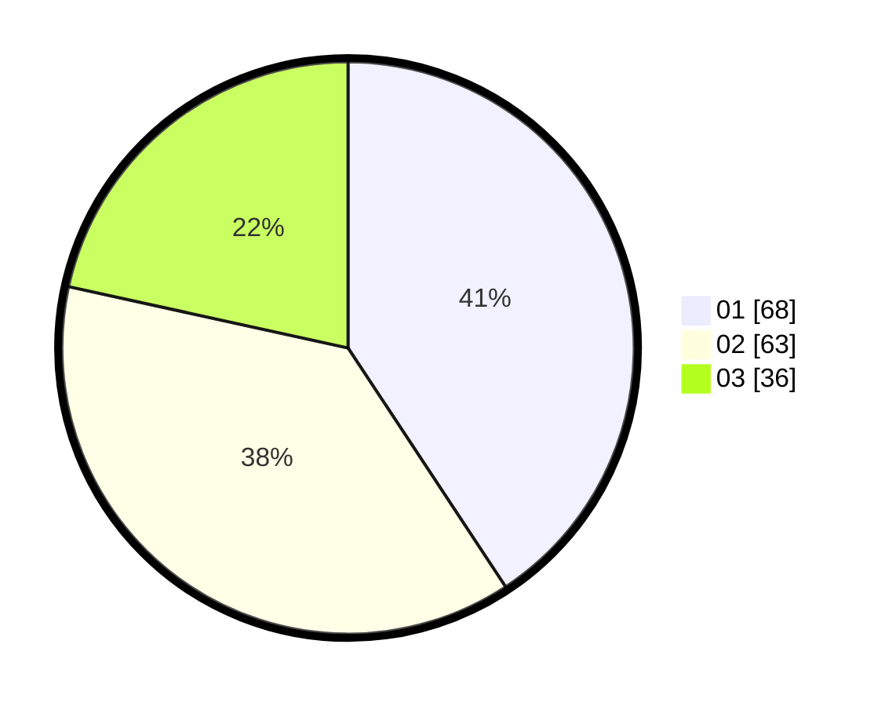

# Hasil

Hasil perolehan suara paslon dapat dilihat pada file paslon-01.txt, paslon-02.txt, dan paslon-03.txt.

Jika tidak ada, artinya data tersebut belum ada pada SIREKAP.

## Perolehan Suara

 * Paslon 01: **68**.
 * Paslon 02: **63**.
 * Paslon 03: **36**.

## Foto C Plano

https://sirekap-obj-formc.kpu.go.id/5e84/pemilu/ppwp/31/74/04/10/07/3174041007089-20240214-204407--e00e7edb-e6c1-482b-a6dd-8e5c681077ea.jpg

https://sirekap-obj-formc.kpu.go.id/5e84/pemilu/ppwp/31/74/04/10/07/3174041007089-20240214-204501--503381f3-6a19-45c9-90fe-539336711596.jpg

https://sirekap-obj-formc.kpu.go.id/5e84/pemilu/ppwp/31/74/04/10/07/3174041007089-20240214-204628--de765476-99bc-4f53-a1c8-5a0a291b1272.jpg

## DATA PEMILIH TETAP

Jumlah pemilih dalam DPT: **213**.
 * L: **106**.
 * P: **107**.

## DATA PENGGUNA HAK PILIH

Jumlah pengguna hak pilih dalam DPT: **169**.
 * L: **79**.
 * P: **90**.

Jumlah pengguna hak pilih dalam DPTb: **0**.
 * L: **0**.
 * P: **0**.

Jumlah pengguna hak pilih dalam DPK: **2**.
 * L: **0**.
 * P: **2**.

Jumlah pengguna hak pilih: **171**.
 * L: **79**.
 * P: **92**.

## JUMLAH SUARA SAH DAN TIDAK SAH

JUMLAH SELURUH SUARA SAH: **167**.

JUMLAH SUARA TIDAK SAH: **4**.

JUMLAH SELURUH SUARA SAH DAN SUARA TIDAK SAH: **171**.
