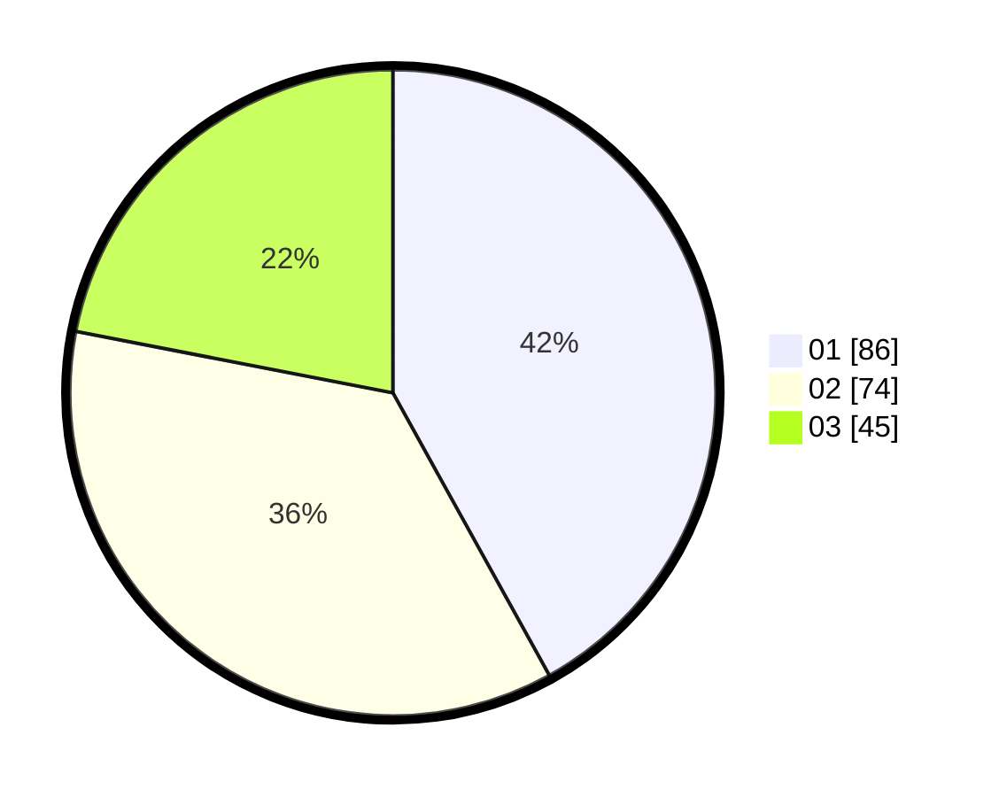

# Hasil

Hasil perolehan suara paslon dapat dilihat pada file paslon-01.txt, paslon-02.txt, dan paslon-03.txt.

Jika tidak ada, artinya data tersebut belum ada pada SIREKAP.

## Perolehan Suara

 * Paslon 01: **86**.
 * Paslon 02: **74**.
 * Paslon 03: **45**.

## Foto C Plano

https://sirekap-obj-formc.kpu.go.id/b045/pemilu/ppwp/31/74/04/10/07/3174041007091-20240214-202536--2a085a17-894a-42da-9472-86fbd3039feb.jpg

https://sirekap-obj-formc.kpu.go.id/b045/pemilu/ppwp/31/74/04/10/07/3174041007091-20240214-202542--dba3165d-c156-4e85-b612-573b98dd896a.jpg

https://sirekap-obj-formc.kpu.go.id/b045/pemilu/ppwp/31/74/04/10/07/3174041007091-20240214-202549--a05a4ba9-866c-40bf-a4ab-a83f1f76db2b.jpg

## DATA PEMILIH TETAP

Jumlah pemilih dalam DPT: **255**.
 * L: **130**.
 * P: **125**.

## DATA PENGGUNA HAK PILIH

Jumlah pengguna hak pilih dalam DPT: **206**.
 * L: **99**.
 * P: **107**.

Jumlah pengguna hak pilih dalam DPTb: **0**.
 * L: **0**.
 * P: **0**.

Jumlah pengguna hak pilih dalam DPK: **3**.
 * L: **2**.
 * P: **1**.

Jumlah pengguna hak pilih: **209**.
 * L: **101**.
 * P: **108**.

## JUMLAH SUARA SAH DAN TIDAK SAH

JUMLAH SELURUH SUARA SAH: **205**.

JUMLAH SUARA TIDAK SAH: **4**.

JUMLAH SELURUH SUARA SAH DAN SUARA TIDAK SAH: **209**.
