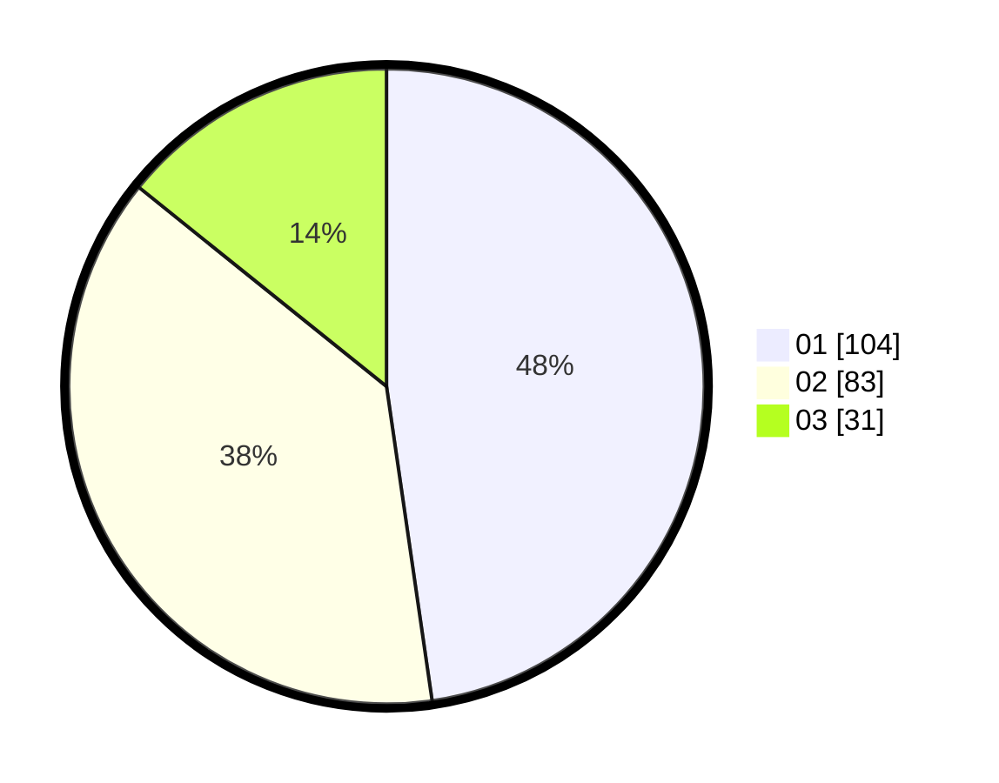

# Hasil

Hasil perolehan suara paslon dapat dilihat pada file paslon-01.txt, paslon-02.txt, dan paslon-03.txt.

Jika tidak ada, artinya data tersebut belum ada pada SIREKAP.

## Perolehan Suara

 * Paslon 01: **104**.
 * Paslon 02: **83**.
 * Paslon 03: **31**.

## Foto C Plano

https://sirekap-obj-formc.kpu.go.id/6b5e/pemilu/ppwp/31/74/04/10/07/3174041007096-20240215-000309--10832629-d17d-4ffe-a0fe-9b36af12d8e7.jpg

https://sirekap-obj-formc.kpu.go.id/6b5e/pemilu/ppwp/31/74/04/10/07/3174041007096-20240215-000355--23ee176e-2bfd-4b6e-ab25-3f600700a535.jpg

https://sirekap-obj-formc.kpu.go.id/6b5e/pemilu/ppwp/31/74/04/10/07/3174041007096-20240215-000444--19fd7186-f504-4dda-8c04-a141bfbf3a35.jpg

## DATA PEMILIH TETAP

Jumlah pemilih dalam DPT: **273**.
 * L: **132**.
 * P: **141**.

## DATA PENGGUNA HAK PILIH

Jumlah pengguna hak pilih dalam DPT: **224**.
 * L: **105**.
 * P: **119**.

Jumlah pengguna hak pilih dalam DPTb: **0**.
 * L: **0**.
 * P: **0**.

Jumlah pengguna hak pilih dalam DPK: **1**.
 * L: **1**.
 * P: **0**.

Jumlah pengguna hak pilih: **225**.
 * L: **106**.
 * P: **119**.

## JUMLAH SUARA SAH DAN TIDAK SAH

JUMLAH SELURUH SUARA SAH: **218**.

JUMLAH SUARA TIDAK SAH: **7**.

JUMLAH SELURUH SUARA SAH DAN SUARA TIDAK SAH: **225**.
