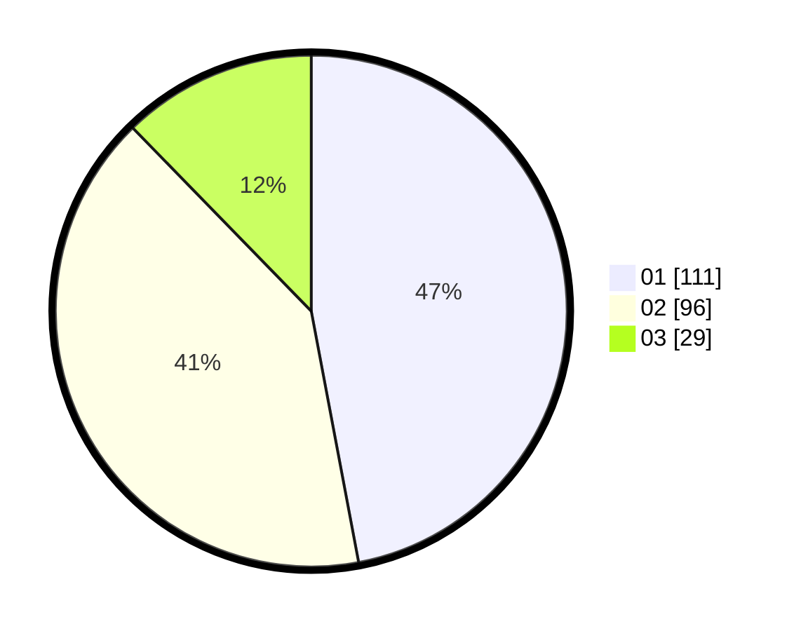

# Hasil

Hasil perolehan suara paslon dapat dilihat pada file paslon-01.txt, paslon-02.txt, dan paslon-03.txt.

Jika tidak ada, artinya data tersebut belum ada pada SIREKAP.

## Perolehan Suara

 * Paslon 01: **111**.
 * Paslon 02: **96**.
 * Paslon 03: **29**.

## Foto C Plano

https://sirekap-obj-formc.kpu.go.id/2f6c/pemilu/ppwp/31/74/04/10/07/3174041007113-20240214-190516--93d2aaea-7ab1-4ff1-8ee0-ae72305d6eac.jpg

https://sirekap-obj-formc.kpu.go.id/2f6c/pemilu/ppwp/31/74/04/10/07/3174041007113-20240214-231249--f7741017-6bff-467c-b0e1-1d5c5fb508ee.jpg

https://sirekap-obj-formc.kpu.go.id/2f6c/pemilu/ppwp/31/74/04/10/07/3174041007113-20240214-231348--e4bb0e24-a270-4ecb-acf0-93fbea3244c4.jpg

## DATA PEMILIH TETAP

Jumlah pemilih dalam DPT: **280**.
 * L: **133**.
 * P: **147**.

## DATA PENGGUNA HAK PILIH

Jumlah pengguna hak pilih dalam DPT: **240**.
 * L: **109**.
 * P: **131**.

Jumlah pengguna hak pilih dalam DPTb: **0**.
 * L: **0**.
 * P: **0**.

Jumlah pengguna hak pilih dalam DPK: **0**.
 * L: **0**.
 * P: **0**.

Jumlah pengguna hak pilih: **240**.
 * L: **109**.
 * P: **131**.

## JUMLAH SUARA SAH DAN TIDAK SAH

JUMLAH SELURUH SUARA SAH: **236**.

JUMLAH SUARA TIDAK SAH: **4**.

JUMLAH SELURUH SUARA SAH DAN SUARA TIDAK SAH: **240**.
