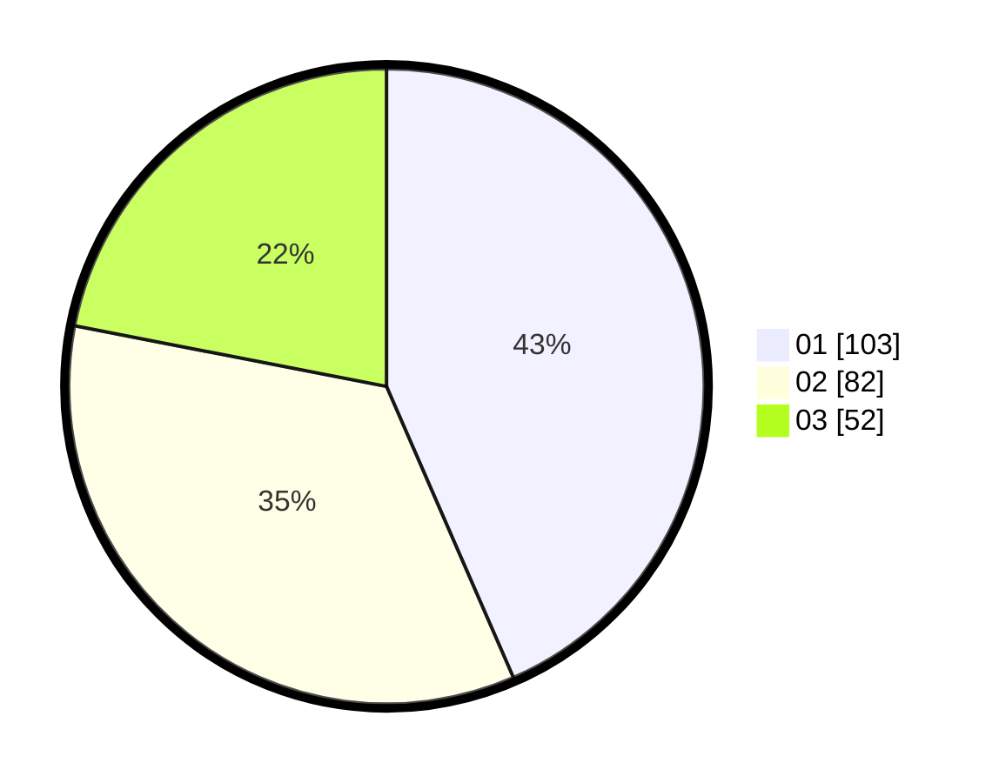

# Hasil

Hasil perolehan suara paslon dapat dilihat pada file paslon-01.txt, paslon-02.txt, dan paslon-03.txt.

Jika tidak ada, artinya data tersebut belum ada pada SIREKAP.

## Perolehan Suara

 * Paslon 01: **103**.
 * Paslon 02: **82**.
 * Paslon 03: **52**.

## Foto C Plano

https://sirekap-obj-formc.kpu.go.id/d710/pemilu/ppwp/31/74/04/10/07/3174041007114-20240215-003000--16b5a51e-a1cf-46cf-b14f-0cbeceee9e02.jpg

https://sirekap-obj-formc.kpu.go.id/d710/pemilu/ppwp/31/74/04/10/07/3174041007114-20240215-003132--8169f9e9-90e3-45b2-aa4c-b05deff69bf9.jpg

https://sirekap-obj-formc.kpu.go.id/d710/pemilu/ppwp/31/74/04/10/07/3174041007114-20240215-003352--6c3727bd-ed05-447f-9a4f-ded0e4f22f5e.jpg

## DATA PEMILIH TETAP

Jumlah pemilih dalam DPT: **260**.
 * L: **134**.
 * P: **126**.

## DATA PENGGUNA HAK PILIH

Jumlah pengguna hak pilih dalam DPT: **223**.
 * L: **112**.
 * P: **111**.

Jumlah pengguna hak pilih dalam DPTb: **11**.
 * L: **5**.
 * P: **6**.

Jumlah pengguna hak pilih dalam DPK: **5**.
 * L: **4**.
 * P: **1**.

Jumlah pengguna hak pilih: **239**.
 * L: **121**.
 * P: **118**.

## JUMLAH SUARA SAH DAN TIDAK SAH

JUMLAH SELURUH SUARA SAH: **237**.

JUMLAH SUARA TIDAK SAH: **2**.

JUMLAH SELURUH SUARA SAH DAN SUARA TIDAK SAH: **239**.
