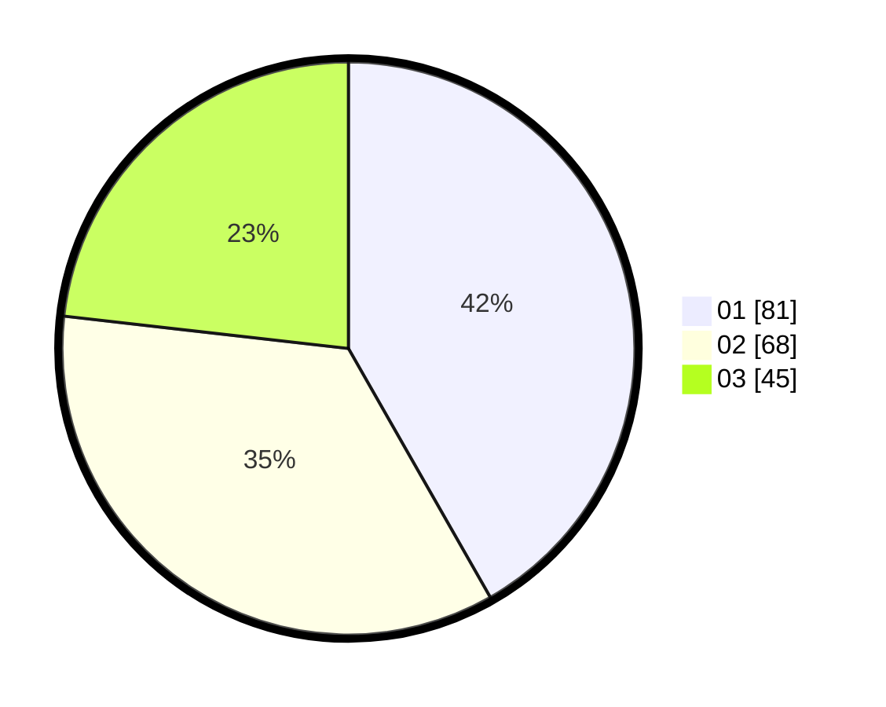

# Hasil

Hasil perolehan suara paslon dapat dilihat pada file paslon-01.txt, paslon-02.txt, dan paslon-03.txt.

Jika tidak ada, artinya data tersebut belum ada pada SIREKAP.

## Perolehan Suara

 * Paslon 01: **81**.
 * Paslon 02: **68**.
 * Paslon 03: **45**.

## Foto C Plano

https://sirekap-obj-formc.kpu.go.id/b8ce/pemilu/ppwp/31/74/04/10/07/3174041007125-20240214-185402--49f05418-066c-4c59-8ee6-55c7e37ac262.jpg

https://sirekap-obj-formc.kpu.go.id/b8ce/pemilu/ppwp/31/74/04/10/07/3174041007125-20240214-185411--6eb3f3cc-5dd5-4af5-a037-9f987716fe61.jpg

https://sirekap-obj-formc.kpu.go.id/b8ce/pemilu/ppwp/31/74/04/10/07/3174041007125-20240214-185418--96316f5b-3e71-4567-91a5-ffb942611ab2.jpg

## DATA PEMILIH TETAP

Jumlah pemilih dalam DPT: **255**.
 * L: **130**.
 * P: **125**.

## DATA PENGGUNA HAK PILIH

Jumlah pengguna hak pilih dalam DPT: **188**.
 * L: **95**.
 * P: **93**.

Jumlah pengguna hak pilih dalam DPTb: **10**.
 * L: **3**.
 * P: **7**.

Jumlah pengguna hak pilih dalam DPK: **1**.
 * L: **1**.
 * P: **0**.

Jumlah pengguna hak pilih: **199**.
 * L: **99**.
 * P: **100**.

## JUMLAH SUARA SAH DAN TIDAK SAH

JUMLAH SELURUH SUARA SAH: **194**.

JUMLAH SUARA TIDAK SAH: **5**.

JUMLAH SELURUH SUARA SAH DAN SUARA TIDAK SAH: **199**.
