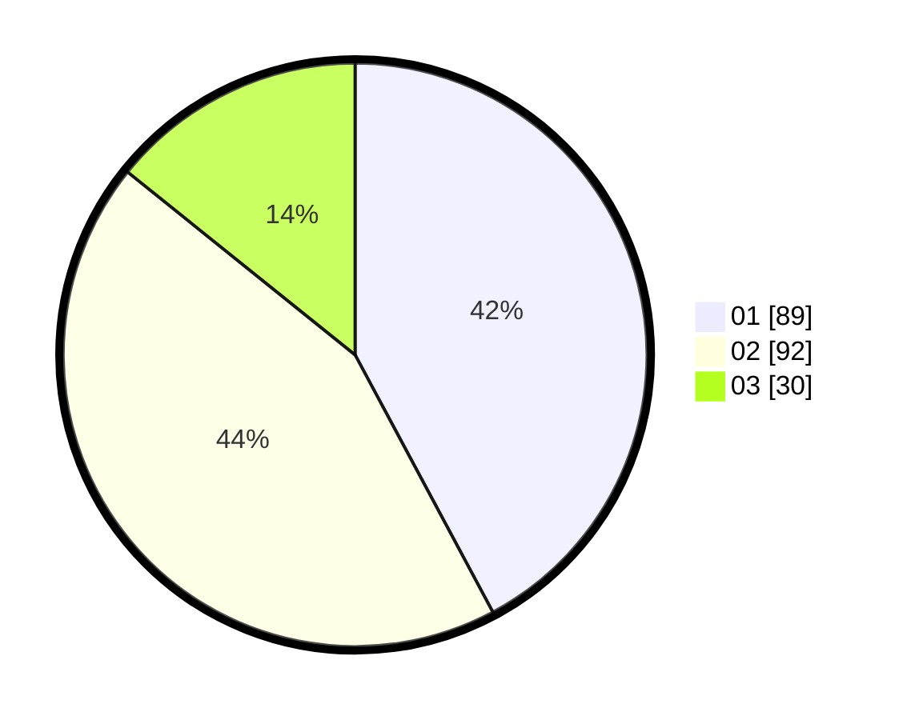

# Hasil

Hasil perolehan suara paslon dapat dilihat pada file paslon-01.txt, paslon-02.txt, dan paslon-03.txt.

Jika tidak ada, artinya data tersebut belum ada pada SIREKAP.

## Perolehan Suara

 * Paslon 01: **89**.
 * Paslon 02: **92**.
 * Paslon 03: **30**.

## Foto C Plano

https://sirekap-obj-formc.kpu.go.id/dff6/pemilu/ppwp/31/74/04/10/07/3174041007126-20240214-155524--d972def3-3ec6-4fea-908d-16daa356cf4d.jpg

https://sirekap-obj-formc.kpu.go.id/dff6/pemilu/ppwp/31/74/04/10/07/3174041007126-20240214-155926--8ecb8adc-ccd3-4f77-bcd3-de4be24cef87.jpg

https://sirekap-obj-formc.kpu.go.id/dff6/pemilu/ppwp/31/74/04/10/07/3174041007126-20240214-191353--ac10f627-cf48-47ba-a480-7bda00d9db15.jpg

## DATA PEMILIH TETAP

Jumlah pemilih dalam DPT: **267**.
 * L: **125**.
 * P: **142**.

## DATA PENGGUNA HAK PILIH

Jumlah pengguna hak pilih dalam DPT: **215**.
 * L: **104**.
 * P: **111**.

Jumlah pengguna hak pilih dalam DPTb: **0**.
 * L: **0**.
 * P: **0**.

Jumlah pengguna hak pilih dalam DPK: **0**.
 * L: **0**.
 * P: **0**.

Jumlah pengguna hak pilih: **215**.
 * L: **104**.
 * P: **111**.

## JUMLAH SUARA SAH DAN TIDAK SAH

JUMLAH SELURUH SUARA SAH: **211**.

JUMLAH SUARA TIDAK SAH: **4**.

JUMLAH SELURUH SUARA SAH DAN SUARA TIDAK SAH: **215**.
