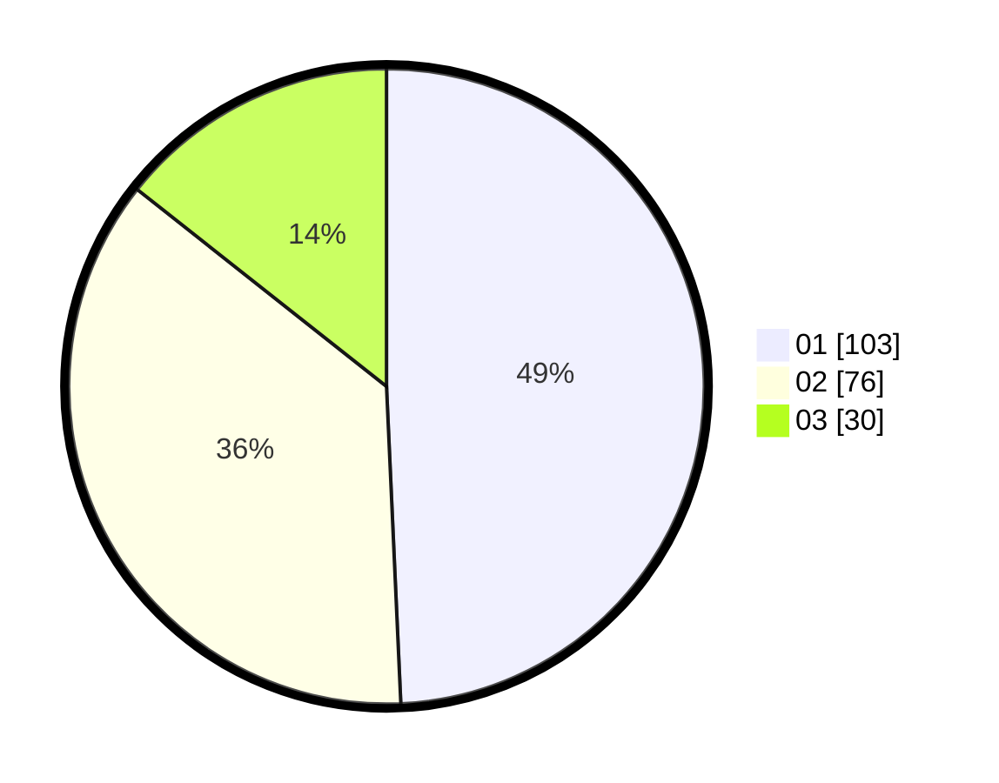

# Hasil

Hasil perolehan suara paslon dapat dilihat pada file paslon-01.txt, paslon-02.txt, dan paslon-03.txt.

Jika tidak ada, artinya data tersebut belum ada pada SIREKAP.

## Perolehan Suara

 * Paslon 01: **103**.
 * Paslon 02: **76**.
 * Paslon 03: **30**.

## Foto C Plano

https://sirekap-obj-formc.kpu.go.id/484d/pemilu/ppwp/31/74/04/10/07/3174041007134-20240214-190013--4188cab0-f54f-42b5-9699-6ab975fca768.jpg

https://sirekap-obj-formc.kpu.go.id/484d/pemilu/ppwp/31/74/04/10/07/3174041007134-20240215-002744--1ddb712a-1b1f-479c-859d-f975fff6dacd.jpg

https://sirekap-obj-formc.kpu.go.id/484d/pemilu/ppwp/31/74/04/10/07/3174041007134-20240214-190017--5cae6641-110e-4d45-a155-4d2caf6b0c9d.jpg

## DATA PEMILIH TETAP

Jumlah pemilih dalam DPT: **260**.
 * L: **130**.
 * P: **130**.

## DATA PENGGUNA HAK PILIH

Jumlah pengguna hak pilih dalam DPT: **213**.
 * L: **103**.
 * P: **110**.

Jumlah pengguna hak pilih dalam DPTb: **0**.
 * L: **0**.
 * P: **0**.

Jumlah pengguna hak pilih dalam DPK: **1**.
 * L: **0**.
 * P: **1**.

Jumlah pengguna hak pilih: **214**.
 * L: **103**.
 * P: **111**.

## JUMLAH SUARA SAH DAN TIDAK SAH

JUMLAH SELURUH SUARA SAH: **209**.

JUMLAH SUARA TIDAK SAH: **5**.

JUMLAH SELURUH SUARA SAH DAN SUARA TIDAK SAH: **214**.
