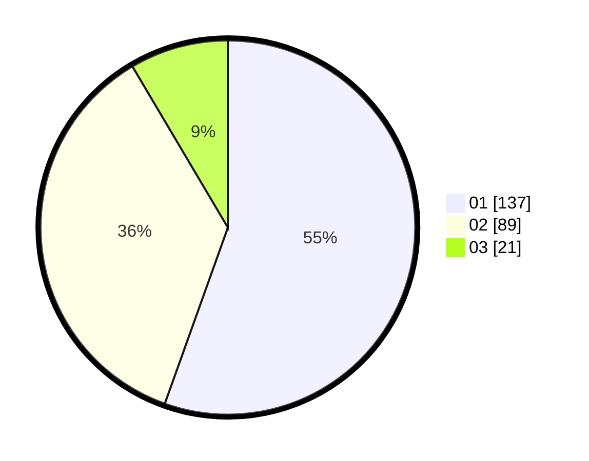

# Hasil

Hasil perolehan suara paslon dapat dilihat pada file paslon-01.txt, paslon-02.txt, dan paslon-03.txt.

Jika tidak ada, artinya data tersebut belum ada pada SIREKAP.

## Perolehan Suara

 * Paslon 01: **137**.
 * Paslon 02: **89**.
 * Paslon 03: **21**.

## Foto C Plano

https://sirekap-obj-formc.kpu.go.id/db79/pemilu/ppwp/31/74/04/10/07/3174041007136-20240215-194855--b901bda1-e820-410f-b16d-652841e5475c.jpg

https://sirekap-obj-formc.kpu.go.id/db79/pemilu/ppwp/31/74/04/10/07/3174041007136-20240215-195037--b152c15b-86f8-4b37-b856-82298381d9b4.jpg

https://sirekap-obj-formc.kpu.go.id/db79/pemilu/ppwp/31/74/04/10/07/3174041007136-20240215-195215--28640550-e5c7-4ef2-919f-f6da40c0aac9.jpg

## DATA PEMILIH TETAP

Jumlah pemilih dalam DPT: **288**.
 * L: **145**.
 * P: **143**.

## DATA PENGGUNA HAK PILIH

Jumlah pengguna hak pilih dalam DPT: **245**.
 * L: **121**.
 * P: **124**.

Jumlah pengguna hak pilih dalam DPTb: **4**.
 * L: **2**.
 * P: **2**.

Jumlah pengguna hak pilih dalam DPK: **2**.
 * L: **2**.
 * P: **0**.

Jumlah pengguna hak pilih: **251**.
 * L: **125**.
 * P: **126**.

## JUMLAH SUARA SAH DAN TIDAK SAH

JUMLAH SELURUH SUARA SAH: **247**.

JUMLAH SUARA TIDAK SAH: **4**.

JUMLAH SELURUH SUARA SAH DAN SUARA TIDAK SAH: **251**.
