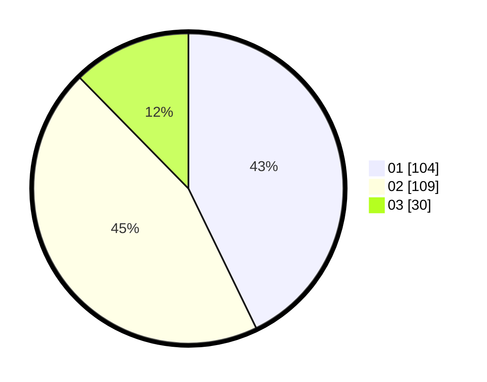

# Hasil

Hasil perolehan suara paslon dapat dilihat pada file paslon-01.txt, paslon-02.txt, dan paslon-03.txt.

Jika tidak ada, artinya data tersebut belum ada pada SIREKAP.

## Perolehan Suara

 * Paslon 01: **104**.
 * Paslon 02: **109**.
 * Paslon 03: **30**.

## Foto C Plano

https://sirekap-obj-formc.kpu.go.id/7be7/pemilu/ppwp/31/74/04/10/07/3174041007137-20240216-081655--8e7b9b84-d819-4717-bae7-5621d0438f25.jpg

https://sirekap-obj-formc.kpu.go.id/7be7/pemilu/ppwp/31/74/04/10/07/3174041007137-20240215-000250--ba01975d-81a6-467f-8ce4-7a004e082ceb.jpg

https://sirekap-obj-formc.kpu.go.id/7be7/pemilu/ppwp/31/74/04/10/07/3174041007137-20240215-000338--eadf7433-5324-4182-8d58-f16e4d301930.jpg

## DATA PEMILIH TETAP

Jumlah pemilih dalam DPT: **294**.
 * L: **152**.
 * P: **142**.

## DATA PENGGUNA HAK PILIH

Jumlah pengguna hak pilih dalam DPT: **237**.
 * L: **115**.
 * P: **122**.

Jumlah pengguna hak pilih dalam DPTb: **5**.
 * L: **3**.
 * P: **2**.

Jumlah pengguna hak pilih dalam DPK: **1**.
 * L: **1**.
 * P: **0**.

Jumlah pengguna hak pilih: **243**.
 * L: **119**.
 * P: **124**.

## JUMLAH SUARA SAH DAN TIDAK SAH

JUMLAH SELURUH SUARA SAH: **243**.

JUMLAH SUARA TIDAK SAH: **0**.

JUMLAH SELURUH SUARA SAH DAN SUARA TIDAK SAH: **243**.
