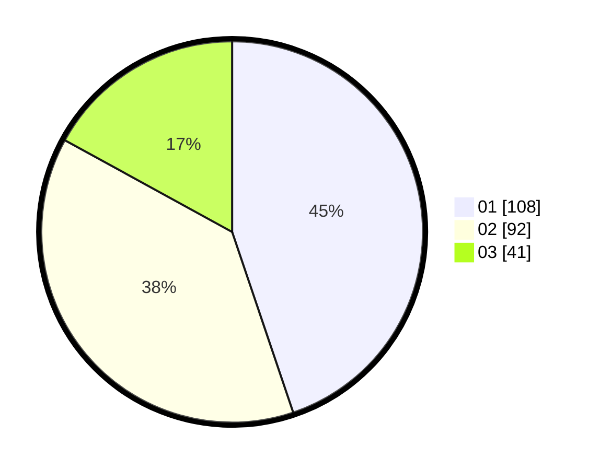

# Hasil

Hasil perolehan suara paslon dapat dilihat pada file paslon-01.txt, paslon-02.txt, dan paslon-03.txt.

Jika tidak ada, artinya data tersebut belum ada pada SIREKAP.

## Perolehan Suara

 * Paslon 01: **108**.
 * Paslon 02: **92**.
 * Paslon 03: **41**.

## Foto C Plano

https://sirekap-obj-formc.kpu.go.id/ecfe/pemilu/ppwp/31/74/04/10/07/3174041007139-20240216-142047--ed666ea6-b161-4b4e-a3cb-37ffea8877bd.jpg

https://sirekap-obj-formc.kpu.go.id/ecfe/pemilu/ppwp/31/74/04/10/07/3174041007139-20240216-142048--f77f49d5-9754-42a5-98cc-ecbd570dd7b4.jpg

https://sirekap-obj-formc.kpu.go.id/ecfe/pemilu/ppwp/31/74/04/10/07/3174041007139-20240216-142048--bb4e7b96-3a16-4ac3-b428-23028aae11d1.jpg

## DATA PEMILIH TETAP

Jumlah pemilih dalam DPT: **283**.
 * L: **137**.
 * P: **146**.

## DATA PENGGUNA HAK PILIH

Jumlah pengguna hak pilih dalam DPT: **242**.
 * L: **112**.
 * P: **130**.

Jumlah pengguna hak pilih dalam DPTb: **0**.
 * L: **0**.
 * P: **0**.

Jumlah pengguna hak pilih dalam DPK: **0**.
 * L: **0**.
 * P: **0**.

Jumlah pengguna hak pilih: **242**.
 * L: **112**.
 * P: **130**.

## JUMLAH SUARA SAH DAN TIDAK SAH

JUMLAH SELURUH SUARA SAH: **241**.

JUMLAH SUARA TIDAK SAH: **1**.

JUMLAH SELURUH SUARA SAH DAN SUARA TIDAK SAH: **242**.
