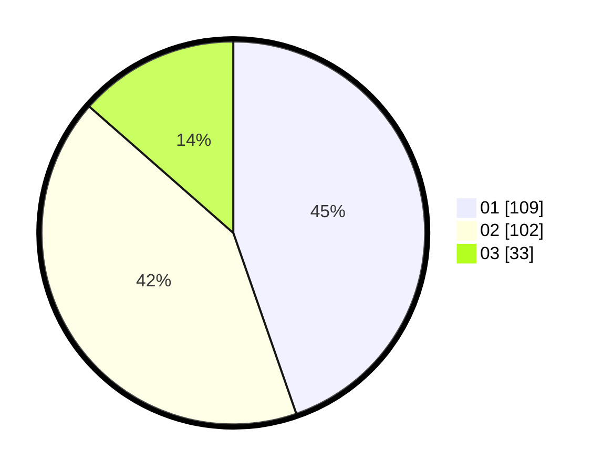

# Hasil

Hasil perolehan suara paslon dapat dilihat pada file paslon-01.txt, paslon-02.txt, dan paslon-03.txt.

Jika tidak ada, artinya data tersebut belum ada pada SIREKAP.

## Perolehan Suara

 * Paslon 01: **109**.
 * Paslon 02: **102**.
 * Paslon 03: **33**.

## Foto C Plano

https://sirekap-obj-formc.kpu.go.id/b43d/pemilu/ppwp/31/74/04/10/07/3174041007140-20240215-003931--21510805-bc0f-455d-9fc0-7f92e3dd5486.jpg

https://sirekap-obj-formc.kpu.go.id/b43d/pemilu/ppwp/31/74/04/10/07/3174041007140-20240214-185610--49697c0f-707b-46e2-a17d-c57caa1fe800.jpg

https://sirekap-obj-formc.kpu.go.id/b43d/pemilu/ppwp/31/74/04/10/07/3174041007140-20240214-185628--68f95c0f-3d7f-4611-83ae-9fcf4f028f74.jpg
