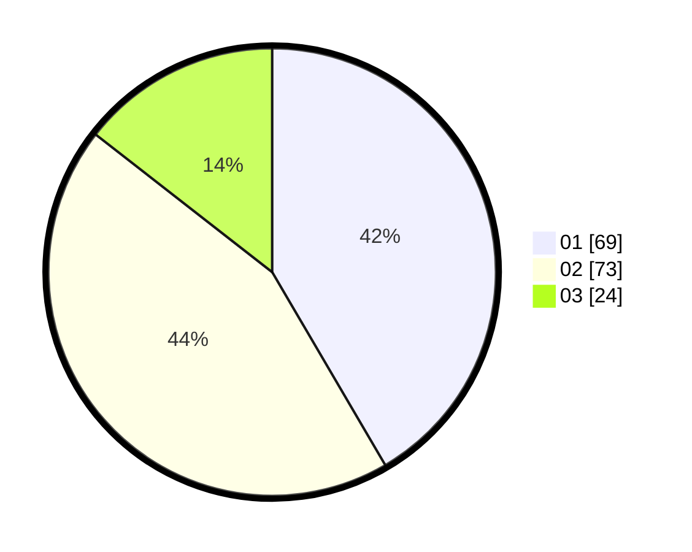

# Hasil

Hasil perolehan suara paslon dapat dilihat pada file paslon-01.txt, paslon-02.txt, dan paslon-03.txt.

Jika tidak ada, artinya data tersebut belum ada pada SIREKAP.

## Perolehan Suara

 * Paslon 01: **69**.
 * Paslon 02: **73**.
 * Paslon 03: **24**.

## Foto C Plano

https://sirekap-obj-formc.kpu.go.id/25b6/pemilu/ppwp/31/74/04/10/07/3174041007141-20240214-193433--66165bd8-1020-4771-a62a-680e6e597c14.jpg

https://sirekap-obj-formc.kpu.go.id/25b6/pemilu/ppwp/31/74/04/10/07/3174041007141-20240214-192524--59660531-3e70-44a2-bc86-269364327674.jpg

https://sirekap-obj-formc.kpu.go.id/25b6/pemilu/ppwp/31/74/04/10/07/3174041007141-20240214-192642--caea1222-44ab-426c-b7d3-630d50554a60.jpg

## DATA PEMILIH TETAP

Jumlah pemilih dalam DPT: **201**.
 * L: **95**.
 * P: **106**.

## DATA PENGGUNA HAK PILIH

Jumlah pengguna hak pilih dalam DPT: **166**.
 * L: **77**.
 * P: **89**.

Jumlah pengguna hak pilih dalam DPTb: **1**.
 * L: **0**.
 * P: **1**.

Jumlah pengguna hak pilih dalam DPK: **0**.
 * L: **0**.
 * P: **0**.

Jumlah pengguna hak pilih: **167**.
 * L: **77**.
 * P: **90**.

## JUMLAH SUARA SAH DAN TIDAK SAH

JUMLAH SELURUH SUARA SAH: **166**.

JUMLAH SUARA TIDAK SAH: **1**.

JUMLAH SELURUH SUARA SAH DAN SUARA TIDAK SAH: **167**.
