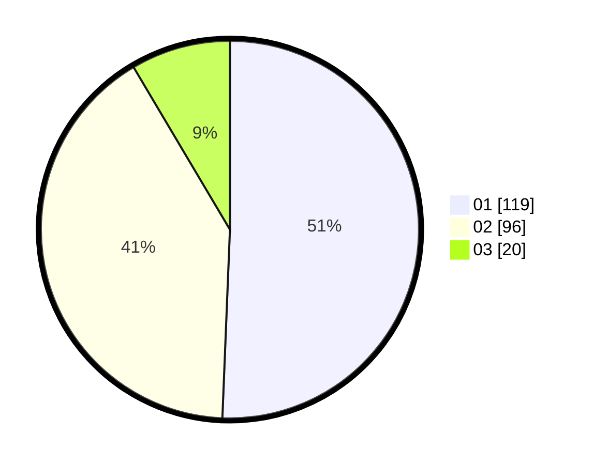

# Hasil

Hasil perolehan suara paslon dapat dilihat pada file paslon-01.txt, paslon-02.txt, dan paslon-03.txt.

Jika tidak ada, artinya data tersebut belum ada pada SIREKAP.

## Perolehan Suara

 * Paslon 01: **119**.
 * Paslon 02: **96**.
 * Paslon 03: **20**.

## Foto C Plano

https://sirekap-obj-formc.kpu.go.id/04f9/pemilu/ppwp/31/74/04/10/07/3174041007143-20240214-205255--5ba69bfd-de1a-46d9-92d3-584278f7da7f.jpg

https://sirekap-obj-formc.kpu.go.id/04f9/pemilu/ppwp/31/74/04/10/07/3174041007143-20240214-205324--6c368a3a-61ac-4eee-b51e-b07905d7e4bd.jpg

https://sirekap-obj-formc.kpu.go.id/04f9/pemilu/ppwp/31/74/04/10/07/3174041007143-20240214-205341--6f46d4c2-c7d8-403e-b6a4-65bfb13da2dd.jpg

## DATA PEMILIH TETAP

Jumlah pemilih dalam DPT: **296**.
 * L: **142**.
 * P: **154**.

## DATA PENGGUNA HAK PILIH

Jumlah pengguna hak pilih dalam DPT: **230**.
 * L: **101**.
 * P: **129**.

Jumlah pengguna hak pilih dalam DPTb: **6**.
 * L: **3**.
 * P: **3**.

Jumlah pengguna hak pilih dalam DPK: **2**.
 * L: **2**.
 * P: **0**.

Jumlah pengguna hak pilih: **238**.
 * L: **106**.
 * P: **132**.

## JUMLAH SUARA SAH DAN TIDAK SAH

JUMLAH SELURUH SUARA SAH: **235**.

JUMLAH SUARA TIDAK SAH: **3**.

JUMLAH SELURUH SUARA SAH DAN SUARA TIDAK SAH: **238**.
