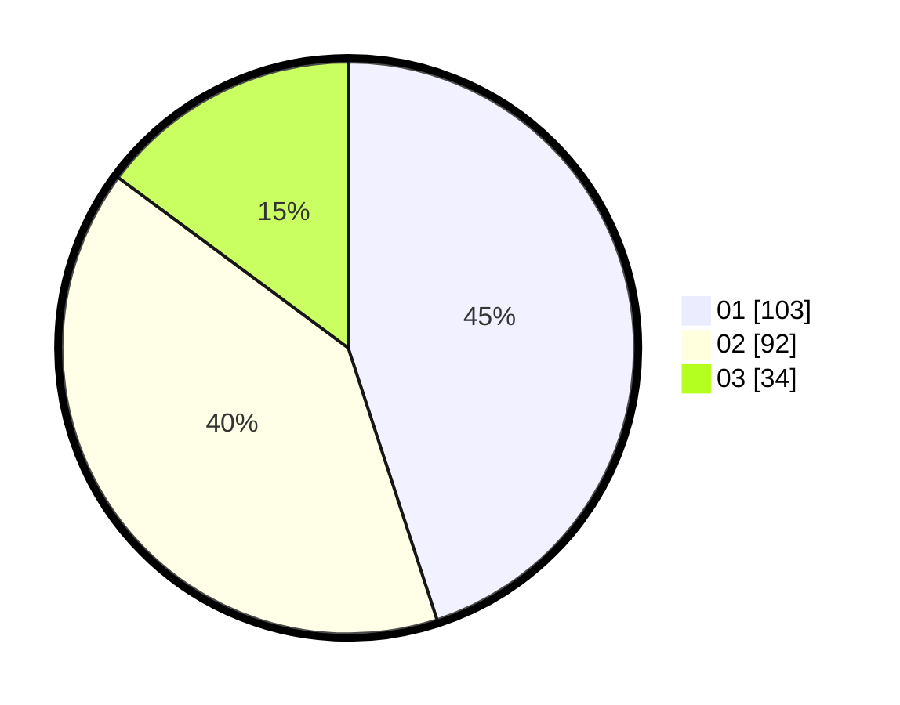

# Hasil

Hasil perolehan suara paslon dapat dilihat pada file paslon-01.txt, paslon-02.txt, dan paslon-03.txt.

Jika tidak ada, artinya data tersebut belum ada pada SIREKAP.

## Perolehan Suara

 * Paslon 01: **103**.
 * Paslon 02: **92**.
 * Paslon 03: **34**.

## Foto C Plano

https://sirekap-obj-formc.kpu.go.id/c659/pemilu/ppwp/31/74/04/10/07/3174041007159-20240214-190421--64f1543e-b05a-450b-9af0-bf098706214e.jpg

https://sirekap-obj-formc.kpu.go.id/c659/pemilu/ppwp/31/74/04/10/07/3174041007159-20240214-190426--8f3b9f72-56fb-4e7d-b712-c09471e353c7.jpg

https://sirekap-obj-formc.kpu.go.id/c659/pemilu/ppwp/31/74/04/10/07/3174041007159-20240214-190436--cfd8ef6b-28eb-4315-808d-9e5714063219.jpg

## DATA PEMILIH TETAP

Jumlah pemilih dalam DPT: **280**.
 * L: **139**.
 * P: **141**.

## DATA PENGGUNA HAK PILIH

Jumlah pengguna hak pilih dalam DPT: **229**.
 * L: **107**.
 * P: **122**.

Jumlah pengguna hak pilih dalam DPTb: **1**.
 * L: **1**.
 * P: **0**.

Jumlah pengguna hak pilih dalam DPK: **3**.
 * L: **1**.
 * P: **2**.

Jumlah pengguna hak pilih: **233**.
 * L: **109**.
 * P: **124**.

## JUMLAH SUARA SAH DAN TIDAK SAH

JUMLAH SELURUH SUARA SAH: **229**.

JUMLAH SUARA TIDAK SAH: **4**.

JUMLAH SELURUH SUARA SAH DAN SUARA TIDAK SAH: **233**.
