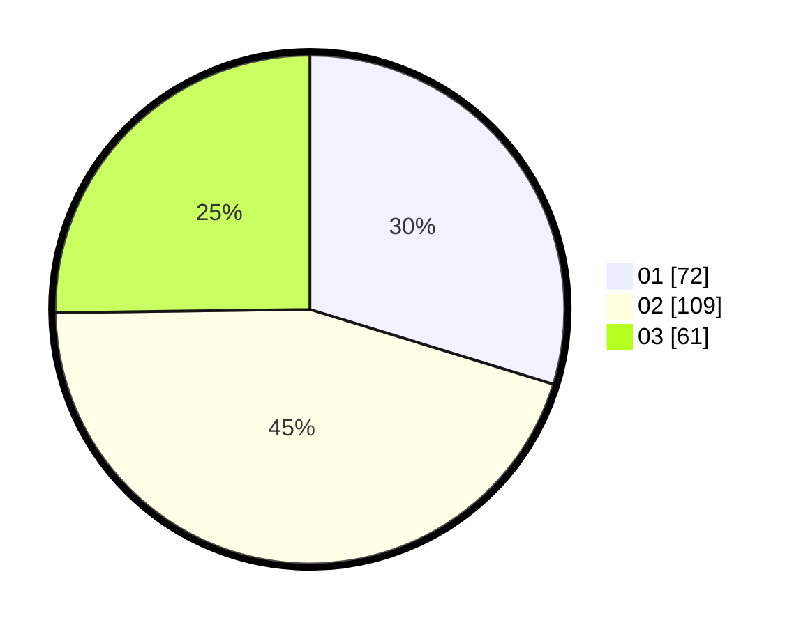

# Hasil

Hasil perolehan suara paslon dapat dilihat pada file paslon-01.txt, paslon-02.txt, dan paslon-03.txt.

Jika tidak ada, artinya data tersebut belum ada pada SIREKAP.

## Perolehan Suara

 * Paslon 01: **72**.
 * Paslon 02: **109**.
 * Paslon 03: **61**.

## Foto C Plano

https://sirekap-obj-formc.kpu.go.id/d6b7/pemilu/ppwp/31/74/05/10/01/3174051001006-20240216-041417--c4df4971-b2ef-48ab-85c7-ef03ce64439e.jpg

https://sirekap-obj-formc.kpu.go.id/d6b7/pemilu/ppwp/31/74/05/10/01/3174051001006-20240216-041431--3fb00013-ea5c-4025-93e7-8770cbcb36be.jpg

https://sirekap-obj-formc.kpu.go.id/d6b7/pemilu/ppwp/31/74/05/10/01/3174051001006-20240216-041426--acc39e5c-2835-4d47-9ddc-5b6f20f53681.jpg

## DATA PEMILIH TETAP

Jumlah pemilih dalam DPT: **223**.
 * L: **112**.
 * P: **111**.

## DATA PENGGUNA HAK PILIH

Jumlah pengguna hak pilih dalam DPT: **223**.
 * L: **112**.
 * P: **111**.

Jumlah pengguna hak pilih dalam DPTb: **22**.
 * L: **12**.
 * P: **10**.

Jumlah pengguna hak pilih dalam DPK: **1**.
 * L: **1**.
 * P: **0**.

Jumlah pengguna hak pilih: **246**.
 * L: **125**.
 * P: **121**.

## JUMLAH SUARA SAH DAN TIDAK SAH

JUMLAH SELURUH SUARA SAH: **242**.

JUMLAH SUARA TIDAK SAH: **4**.

JUMLAH SELURUH SUARA SAH DAN SUARA TIDAK SAH: **246**.
