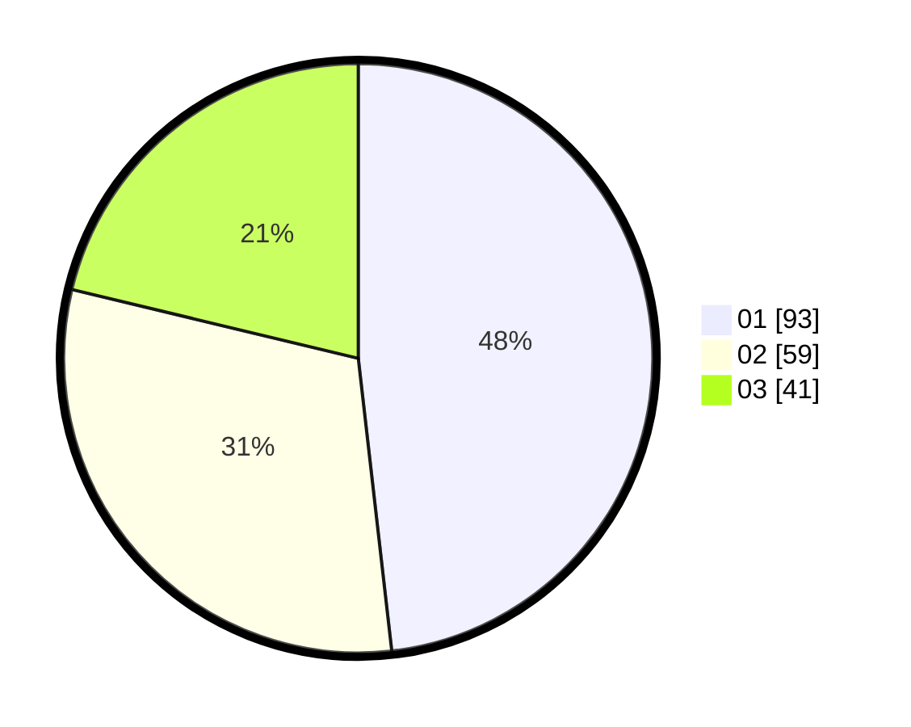

# Hasil

Hasil perolehan suara paslon dapat dilihat pada file paslon-01.txt, paslon-02.txt, dan paslon-03.txt.

Jika tidak ada, artinya data tersebut belum ada pada SIREKAP.

## Perolehan Suara

 * Paslon 01: **93**.
 * Paslon 02: **59**.
 * Paslon 03: **41**.

## Foto C Plano

https://sirekap-obj-formc.kpu.go.id/0206/pemilu/ppwp/31/74/05/10/01/3174051001017-20240216-183001--807939ba-3ebb-45e9-a814-6967ca72ee15.jpg

https://sirekap-obj-formc.kpu.go.id/0206/pemilu/ppwp/31/74/05/10/01/3174051001017-20240216-183003--68e09a80-9e78-437b-b1d5-77e61525038e.jpg

https://sirekap-obj-formc.kpu.go.id/0206/pemilu/ppwp/31/74/05/10/01/3174051001017-20240216-183002--5793d90d-ba0d-4d69-9075-fb544b379513.jpg

## DATA PEMILIH TETAP

Jumlah pemilih dalam DPT: **272**.
 * L: **142**.
 * P: **130**.

## DATA PENGGUNA HAK PILIH

Jumlah pengguna hak pilih dalam DPT: **181**.
 * L: **91**.
 * P: **90**.

Jumlah pengguna hak pilih dalam DPTb: **9**.
 * L: **5**.
 * P: **4**.

Jumlah pengguna hak pilih dalam DPK: **4**.
 * L: **2**.
 * P: **2**.

Jumlah pengguna hak pilih: **194**.
 * L: **98**.
 * P: **96**.

## JUMLAH SUARA SAH DAN TIDAK SAH

JUMLAH SELURUH SUARA SAH: **193**.

JUMLAH SUARA TIDAK SAH: **1**.

JUMLAH SELURUH SUARA SAH DAN SUARA TIDAK SAH: **194**.
