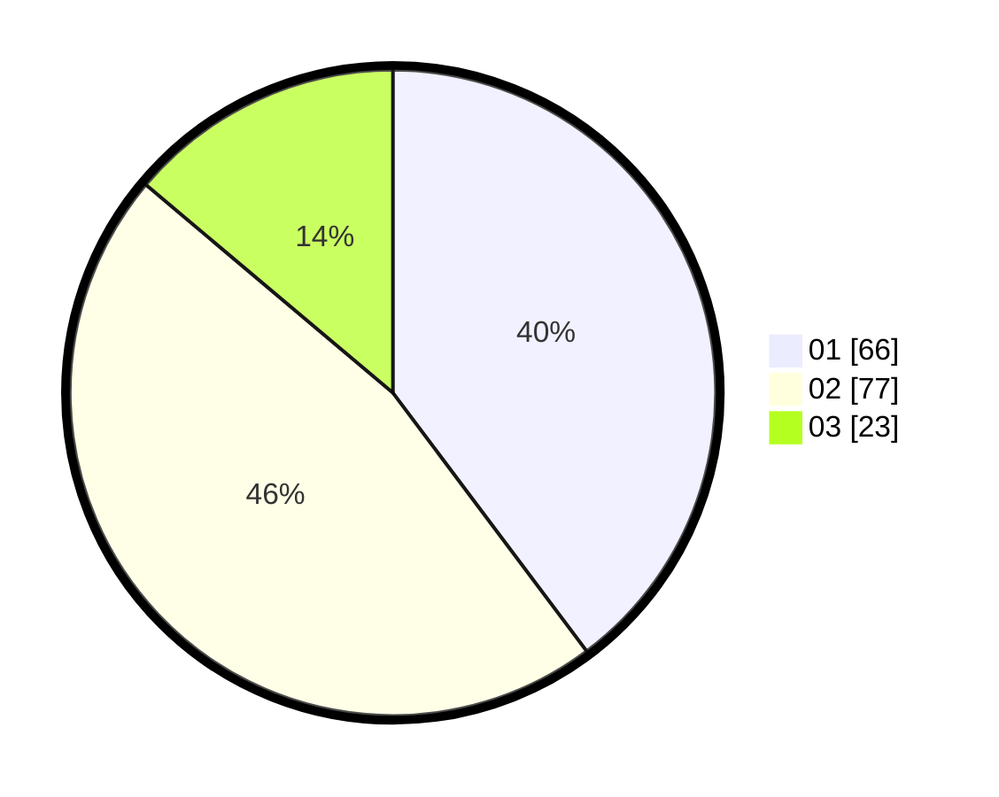

# Hasil

Hasil perolehan suara paslon dapat dilihat pada file paslon-01.txt, paslon-02.txt, dan paslon-03.txt.

Jika tidak ada, artinya data tersebut belum ada pada SIREKAP.

## Perolehan Suara

 * Paslon 01: **66**.
 * Paslon 02: **77**.
 * Paslon 03: **23**.

## Foto C Plano

https://sirekap-obj-formc.kpu.go.id/32c3/pemilu/ppwp/31/74/05/10/01/3174051001021-20240214-234929--f1d936c2-3a52-49f8-a72a-db632e301c7e.jpg

https://sirekap-obj-formc.kpu.go.id/32c3/pemilu/ppwp/31/74/05/10/01/3174051001021-20240214-235026--8768f1b5-6408-4378-b7e2-8f13074fdfbf.jpg

https://sirekap-obj-formc.kpu.go.id/32c3/pemilu/ppwp/31/74/05/10/01/3174051001021-20240214-235112--fe653897-a96c-47bf-9eae-bd10c938d1a1.jpg
