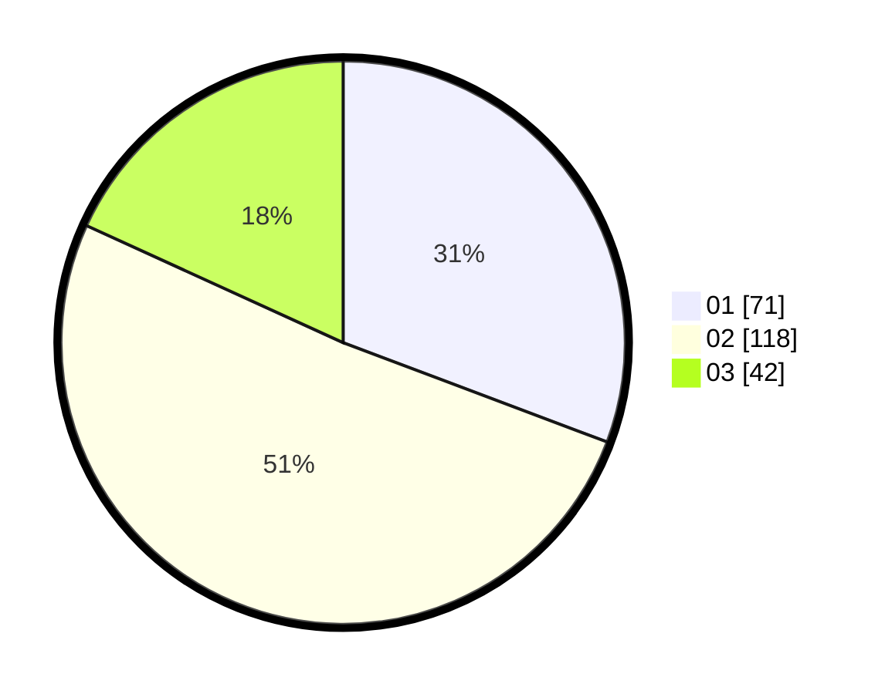

# Hasil

Hasil perolehan suara paslon dapat dilihat pada file paslon-01.txt, paslon-02.txt, dan paslon-03.txt.

Jika tidak ada, artinya data tersebut belum ada pada SIREKAP.

## Perolehan Suara

 * Paslon 01: **71**.
 * Paslon 02: **118**.
 * Paslon 03: **42**.

## Foto C Plano

https://sirekap-obj-formc.kpu.go.id/6c51/pemilu/ppwp/31/74/05/10/01/3174051001027-20240215-034151--a43dda04-a292-425a-aa75-95fc29b9f780.jpg

https://sirekap-obj-formc.kpu.go.id/6c51/pemilu/ppwp/31/74/05/10/01/3174051001027-20240215-034305--91808242-3d02-48cf-b276-57e893dc5048.jpg

https://sirekap-obj-formc.kpu.go.id/6c51/pemilu/ppwp/31/74/05/10/01/3174051001027-20240215-034402--eb1afd6c-7332-4618-9aca-de32d73fb794.jpg

## DATA PEMILIH TETAP

Jumlah pemilih dalam DPT: **283**.
 * L: **139**.
 * P: **144**.

## DATA PENGGUNA HAK PILIH

Jumlah pengguna hak pilih dalam DPT: **222**.
 * L: **103**.
 * P: **119**.

Jumlah pengguna hak pilih dalam DPTb: **11**.
 * L: **8**.
 * P: **3**.

Jumlah pengguna hak pilih dalam DPK: **2**.
 * L: **2**.
 * P: **0**.

Jumlah pengguna hak pilih: **235**.
 * L: **113**.
 * P: **122**.

## JUMLAH SUARA SAH DAN TIDAK SAH

JUMLAH SELURUH SUARA SAH: **231**.

JUMLAH SUARA TIDAK SAH: **4**.

JUMLAH SELURUH SUARA SAH DAN SUARA TIDAK SAH: **235**.
