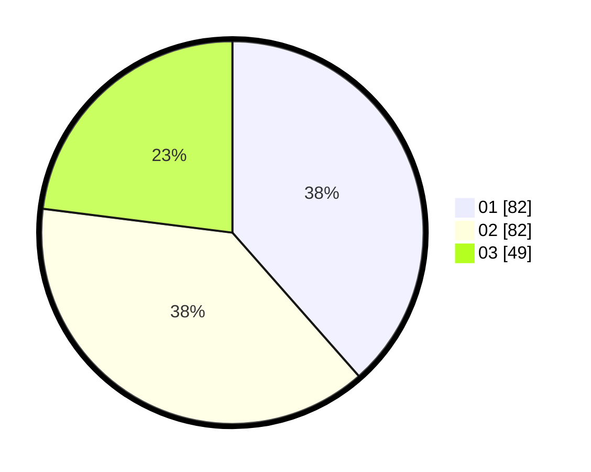

# Hasil

Hasil perolehan suara paslon dapat dilihat pada file paslon-01.txt, paslon-02.txt, dan paslon-03.txt.

Jika tidak ada, artinya data tersebut belum ada pada SIREKAP.

## Perolehan Suara

 * Paslon 01: **82**.
 * Paslon 02: **82**.
 * Paslon 03: **49**.

## Foto C Plano

https://sirekap-obj-formc.kpu.go.id/8510/pemilu/ppwp/31/74/05/10/01/3174051001038-20240214-162241--f47dc0f6-f40a-43cb-b8cf-818704b088df.jpg

https://sirekap-obj-formc.kpu.go.id/8510/pemilu/ppwp/31/74/05/10/01/3174051001038-20240215-011826--183de586-6869-47f3-9ef9-487d9d681685.jpg

https://sirekap-obj-formc.kpu.go.id/8510/pemilu/ppwp/31/74/05/10/01/3174051001038-20240215-012030--ac0e2d49-b263-42c6-b60e-772dc97d5284.jpg

## DATA PEMILIH TETAP

Jumlah pemilih dalam DPT: **278**.
 * L: **137**.
 * P: **141**.

## DATA PENGGUNA HAK PILIH

Jumlah pengguna hak pilih dalam DPT: **217**.
 * L: **110**.
 * P: **107**.

Jumlah pengguna hak pilih dalam DPTb: **0**.
 * L: **0**.
 * P: **0**.

Jumlah pengguna hak pilih dalam DPK: **1**.
 * L: **0**.
 * P: **1**.

Jumlah pengguna hak pilih: **218**.
 * L: **110**.
 * P: **108**.

## JUMLAH SUARA SAH DAN TIDAK SAH

JUMLAH SELURUH SUARA SAH: **213**.

JUMLAH SUARA TIDAK SAH: **5**.

JUMLAH SELURUH SUARA SAH DAN SUARA TIDAK SAH: **218**.
