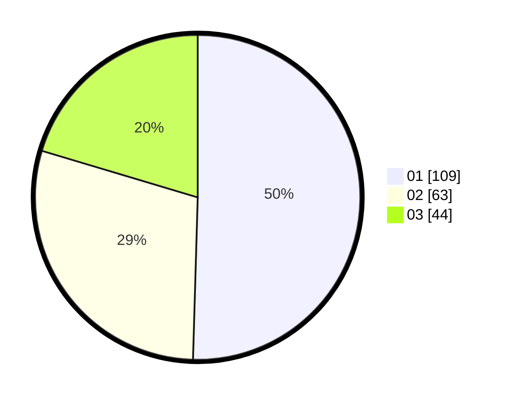

# Hasil

Hasil perolehan suara paslon dapat dilihat pada file paslon-01.txt, paslon-02.txt, dan paslon-03.txt.

Jika tidak ada, artinya data tersebut belum ada pada SIREKAP.

## Perolehan Suara

 * Paslon 01: **109**.
 * Paslon 02: **63**.
 * Paslon 03: **44**.

## Foto C Plano

https://sirekap-obj-formc.kpu.go.id/8163/pemilu/ppwp/31/74/05/10/01/3174051001085-20240215-031849--879ce798-aa54-4576-9077-bf478d9501c6.jpg

https://sirekap-obj-formc.kpu.go.id/8163/pemilu/ppwp/31/74/05/10/01/3174051001085-20240215-032017--877c94f1-1c1c-4f42-8ffd-899b6688a3ec.jpg

https://sirekap-obj-formc.kpu.go.id/8163/pemilu/ppwp/31/74/05/10/01/3174051001085-20240215-032158--ae6cd89c-04de-461f-ba01-10e78a55f588.jpg

## DATA PEMILIH TETAP

Jumlah pemilih dalam DPT: **267**.
 * L: **130**.
 * P: **137**.

## DATA PENGGUNA HAK PILIH

Jumlah pengguna hak pilih dalam DPT: **219**.
 * L: **109**.
 * P: **110**.

Jumlah pengguna hak pilih dalam DPTb: **0**.
 * L: **0**.
 * P: **0**.

Jumlah pengguna hak pilih dalam DPK: **3**.
 * L: **1**.
 * P: **2**.

Jumlah pengguna hak pilih: **222**.
 * L: **110**.
 * P: **112**.

## JUMLAH SUARA SAH DAN TIDAK SAH

JUMLAH SELURUH SUARA SAH: **216**.

JUMLAH SUARA TIDAK SAH: **6**.

JUMLAH SELURUH SUARA SAH DAN SUARA TIDAK SAH: **222**.
