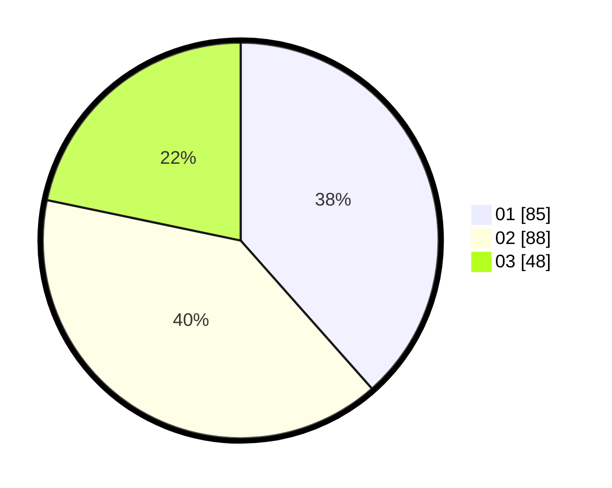

# Hasil

Hasil perolehan suara paslon dapat dilihat pada file paslon-01.txt, paslon-02.txt, dan paslon-03.txt.

Jika tidak ada, artinya data tersebut belum ada pada SIREKAP.

## Perolehan Suara

 * Paslon 01: **85**.
 * Paslon 02: **88**.
 * Paslon 03: **48**.

## Foto C Plano

https://sirekap-obj-formc.kpu.go.id/d36d/pemilu/ppwp/31/74/05/10/01/3174051001095-20240216-053121--002d0436-32f2-49f1-9277-ce643ee646ab.jpg

https://sirekap-obj-formc.kpu.go.id/d36d/pemilu/ppwp/31/74/05/10/01/3174051001095-20240214-202627--efb0abe9-4168-400a-ab8e-60b3fa78bc62.jpg

https://sirekap-obj-formc.kpu.go.id/d36d/pemilu/ppwp/31/74/05/10/01/3174051001095-20240214-202642--f6913283-ef99-4f20-b184-546ecb91cbfd.jpg

## DATA PEMILIH TETAP

Jumlah pemilih dalam DPT: **264**.
 * L: **130**.
 * P: **134**.

## DATA PENGGUNA HAK PILIH

Jumlah pengguna hak pilih dalam DPT: **215**.
 * L: **102**.
 * P: **113**.

Jumlah pengguna hak pilih dalam DPTb: **4**.
 * L: **2**.
 * P: **2**.

Jumlah pengguna hak pilih dalam DPK: **4**.
 * L: **2**.
 * P: **2**.

Jumlah pengguna hak pilih: **223**.
 * L: **106**.
 * P: **117**.

## JUMLAH SUARA SAH DAN TIDAK SAH

JUMLAH SELURUH SUARA SAH: **221**.

JUMLAH SUARA TIDAK SAH: **2**.

JUMLAH SELURUH SUARA SAH DAN SUARA TIDAK SAH: **223**.
