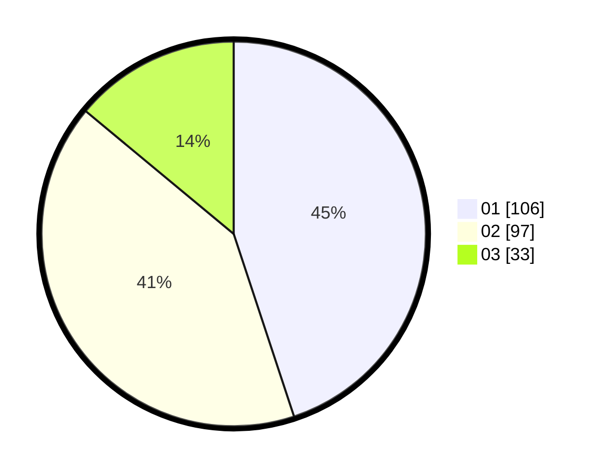

# Hasil

Hasil perolehan suara paslon dapat dilihat pada file paslon-01.txt, paslon-02.txt, dan paslon-03.txt.

Jika tidak ada, artinya data tersebut belum ada pada SIREKAP.

## Perolehan Suara

 * Paslon 01: **106**.
 * Paslon 02: **97**.
 * Paslon 03: **33**.

## Foto C Plano

https://sirekap-obj-formc.kpu.go.id/6253/pemilu/ppwp/31/74/05/10/01/3174051001129-20240216-121638--9292bb5b-dbce-4dd0-82be-24daf98c34dd.jpg

https://sirekap-obj-formc.kpu.go.id/6253/pemilu/ppwp/31/74/05/10/01/3174051001129-20240214-155013--e716f04c-d239-447a-93df-cf1cde3f399a.jpg

https://sirekap-obj-formc.kpu.go.id/6253/pemilu/ppwp/31/74/05/10/01/3174051001129-20240214-155104--7ff180fd-85ec-44d5-8488-9e4e3467b9dd.jpg

## DATA PEMILIH TETAP

Jumlah pemilih dalam DPT: **0**.
 * L: **0**.
 * P: **0**.

## DATA PENGGUNA HAK PILIH

Jumlah pengguna hak pilih dalam DPT: **238**.
 * L: **127**.
 * P: **111**.

Jumlah pengguna hak pilih dalam DPTb: **0**.
 * L: **0**.
 * P: **0**.

Jumlah pengguna hak pilih dalam DPK: **3**.
 * L: **0**.
 * P: **3**.

Jumlah pengguna hak pilih: **241**.
 * L: **127**.
 * P: **114**.

## JUMLAH SUARA SAH DAN TIDAK SAH

JUMLAH SELURUH SUARA SAH: **236**.

JUMLAH SUARA TIDAK SAH: **5**.

JUMLAH SELURUH SUARA SAH DAN SUARA TIDAK SAH: **241**.
