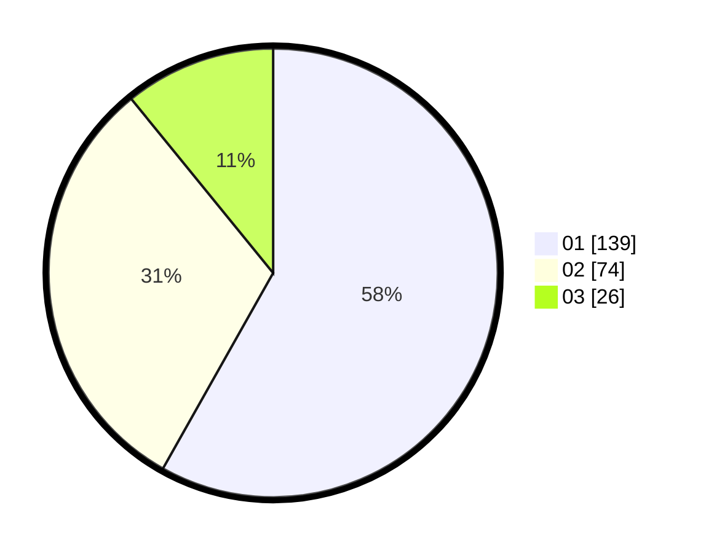

# Hasil

Hasil perolehan suara paslon dapat dilihat pada file paslon-01.txt, paslon-02.txt, dan paslon-03.txt.

Jika tidak ada, artinya data tersebut belum ada pada SIREKAP.

## Perolehan Suara

 * Paslon 01: **139**.
 * Paslon 02: **74**.
 * Paslon 03: **26**.

## Foto C Plano

https://sirekap-obj-formc.kpu.go.id/55cd/pemilu/ppwp/31/74/05/10/02/3174051002004-20240217-161407--e4135c45-9cf5-49d9-babc-1930e85b93b2.jpg

https://sirekap-obj-formc.kpu.go.id/55cd/pemilu/ppwp/31/74/05/10/02/3174051002004-20240217-161456--faec898a-45fd-4cb9-9152-0ef265d5949b.jpg

https://sirekap-obj-formc.kpu.go.id/55cd/pemilu/ppwp/31/74/05/10/02/3174051002004-20240217-161957--f6437420-57f9-4711-84b3-afc66dbf3901.jpg

## DATA PEMILIH TETAP

Jumlah pemilih dalam DPT: **282**.
 * L: **149**.
 * P: **133**.

## DATA PENGGUNA HAK PILIH

Jumlah pengguna hak pilih dalam DPT: **234**.
 * L: **125**.
 * P: **109**.

Jumlah pengguna hak pilih dalam DPTb: **885**.
 * L: **84**.
 * P: **482**.

Jumlah pengguna hak pilih dalam DPK: **1**.
 * L: **8**.
 * P: **0**.

Jumlah pengguna hak pilih: **240**.
 * L: **229**.
 * P: **612**.

## JUMLAH SUARA SAH DAN TIDAK SAH

JUMLAH SELURUH SUARA SAH: **239**.

JUMLAH SUARA TIDAK SAH: **1**.

JUMLAH SELURUH SUARA SAH DAN SUARA TIDAK SAH: **240**.
