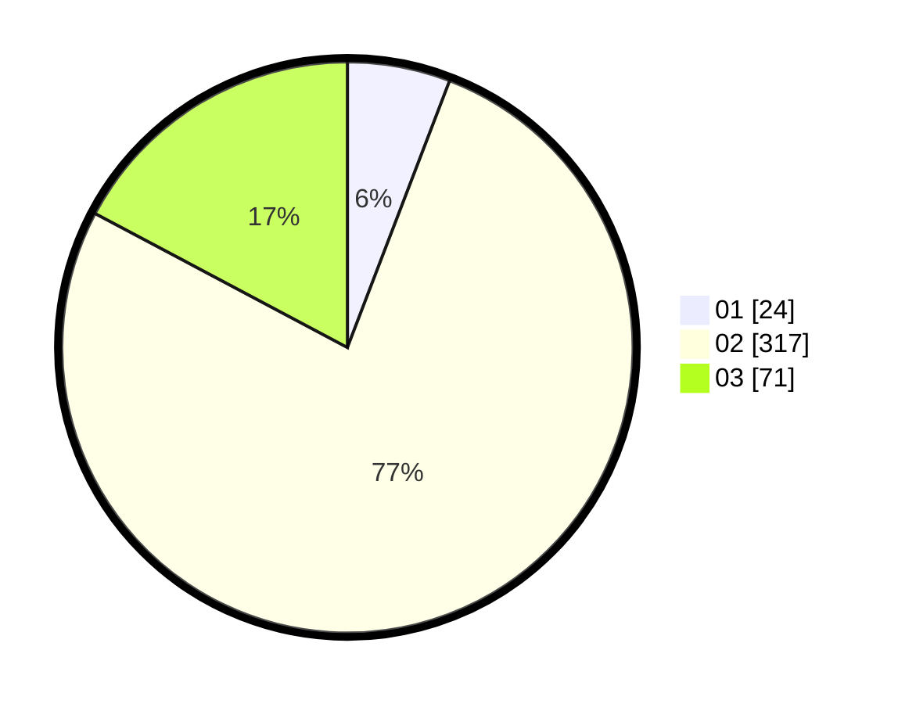

# Hasil

Hasil perolehan suara paslon dapat dilihat pada file paslon-01.txt, paslon-02.txt, dan paslon-03.txt.

Jika tidak ada, artinya data tersebut belum ada pada SIREKAP.

## Perolehan Suara

 * Paslon 01: **24**.
 * Paslon 02: **317**.
 * Paslon 03: **71**.

## Foto C Plano

https://sirekap-obj-formc.kpu.go.id/f470/pemilu/ppwp/31/74/05/10/02/3174051002006-20240217-180316--707916ae-2f3d-4936-98fc-8fd93f5992b6.jpg

https://sirekap-obj-formc.kpu.go.id/f470/pemilu/ppwp/31/74/05/10/02/3174051002006-20240217-180211--249715e1-1d0c-41eb-bd24-bdb2f4cae56a.jpg

https://sirekap-obj-formc.kpu.go.id/f470/pemilu/ppwp/31/74/05/10/02/3174051002006-20240217-180350--fa8cd390-e28f-4a6e-b6b7-36dc0b100061.jpg

## DATA PEMILIH TETAP

Jumlah pemilih dalam DPT: **275**.
 * L: **172**.
 * P: **144**.

## DATA PENGGUNA HAK PILIH

Jumlah pengguna hak pilih dalam DPT: **225**.
 * L: **107**.
 * P: **119**.

Jumlah pengguna hak pilih dalam DPTb: **5**.
 * L: **0**.
 * P: **5**.

Jumlah pengguna hak pilih dalam DPK: **0**.
 * L: **0**.
 * P: **0**.

Jumlah pengguna hak pilih: **221**.
 * L: **107**.
 * P: **124**.

## JUMLAH SUARA SAH DAN TIDAK SAH

JUMLAH SELURUH SUARA SAH: **225**.

JUMLAH SUARA TIDAK SAH: **5**.

JUMLAH SELURUH SUARA SAH DAN SUARA TIDAK SAH: **221**.
