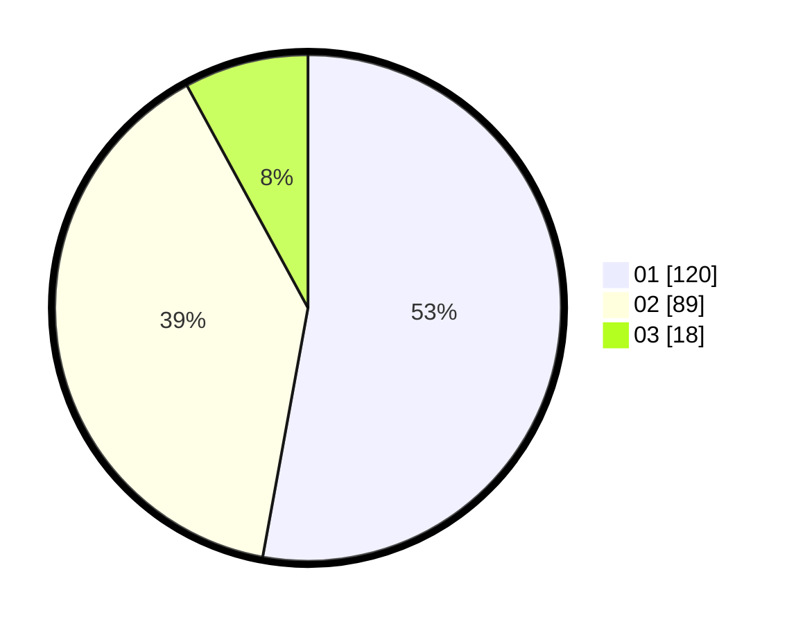

# Hasil

Hasil perolehan suara paslon dapat dilihat pada file paslon-01.txt, paslon-02.txt, dan paslon-03.txt.

Jika tidak ada, artinya data tersebut belum ada pada SIREKAP.

## Perolehan Suara

 * Paslon 01: **120**.
 * Paslon 02: **89**.
 * Paslon 03: **18**.

## Foto C Plano

https://sirekap-obj-formc.kpu.go.id/f581/pemilu/ppwp/31/74/05/10/02/3174051002007-20240217-191233--973d490f-4795-45cc-808f-fad192d8974c.jpg

https://sirekap-obj-formc.kpu.go.id/f581/pemilu/ppwp/31/74/05/10/02/3174051002007-20240217-191348--4bcc1d08-0be6-4cdc-bf57-9b676aa5b083.jpg

https://sirekap-obj-formc.kpu.go.id/f581/pemilu/ppwp/31/74/05/10/02/3174051002007-20240217-191454--bf0b31af-7cf0-4d89-b62d-720d1c25f35e.jpg

## DATA PEMILIH TETAP

Jumlah pemilih dalam DPT: **25**.
 * L: **145**.
 * P: **124**.

## DATA PENGGUNA HAK PILIH

Jumlah pengguna hak pilih dalam DPT: **221**.
 * L: **712**.
 * P: **114**.

Jumlah pengguna hak pilih dalam DPTb: **1**.
 * L: **0**.
 * P: **1**.

Jumlah pengguna hak pilih dalam DPK: **0**.
 * L: **0**.
 * P: **0**.

Jumlah pengguna hak pilih: **222**.
 * L: **110**.
 * P: **120**.

## JUMLAH SUARA SAH DAN TIDAK SAH

JUMLAH SELURUH SUARA SAH: **227**.

JUMLAH SUARA TIDAK SAH: **5**.

JUMLAH SELURUH SUARA SAH DAN SUARA TIDAK SAH: **232**.
