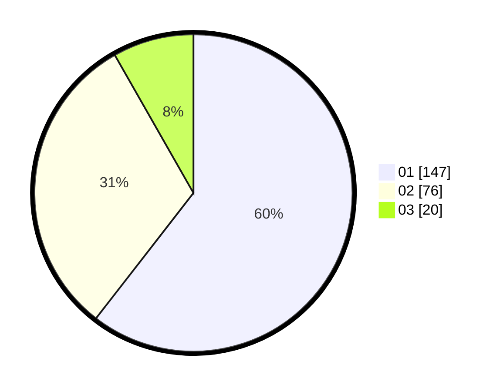

# Hasil

Hasil perolehan suara paslon dapat dilihat pada file paslon-01.txt, paslon-02.txt, dan paslon-03.txt.

Jika tidak ada, artinya data tersebut belum ada pada SIREKAP.

## Perolehan Suara

 * Paslon 01: **147**.
 * Paslon 02: **76**.
 * Paslon 03: **20**.

## Foto C Plano

https://sirekap-obj-formc.kpu.go.id/350e/pemilu/ppwp/31/74/05/10/02/3174051002013-20240217-235729--4657bd32-0e84-4c38-81f4-927855f61fa4.jpg

https://sirekap-obj-formc.kpu.go.id/350e/pemilu/ppwp/31/74/05/10/02/3174051002013-20240217-235808--48fb2657-afdb-4c61-b225-b8df316e6554.jpg

https://sirekap-obj-formc.kpu.go.id/350e/pemilu/ppwp/31/74/05/10/02/3174051002013-20240217-235849--2f65b6eb-ff6a-4eed-a367-b5a9dfcb2235.jpg

## DATA PEMILIH TETAP

Jumlah pemilih dalam DPT: **81**.
 * L: **147**.
 * P: **137**.

## DATA PENGGUNA HAK PILIH

Jumlah pengguna hak pilih dalam DPT: **275**.
 * L: **121**.
 * P: **114**.

Jumlah pengguna hak pilih dalam DPTb: **5**.
 * L: **2**.
 * P: **7**.

Jumlah pengguna hak pilih dalam DPK: **7**.
 * L: **11**.
 * P: **2**.

Jumlah pengguna hak pilih: **547**.
 * L: **154**.
 * P: **114**.

## JUMLAH SUARA SAH DAN TIDAK SAH

JUMLAH SELURUH SUARA SAH: **247**.

JUMLAH SUARA TIDAK SAH: **0**.

JUMLAH SELURUH SUARA SAH DAN SUARA TIDAK SAH: **43**.
