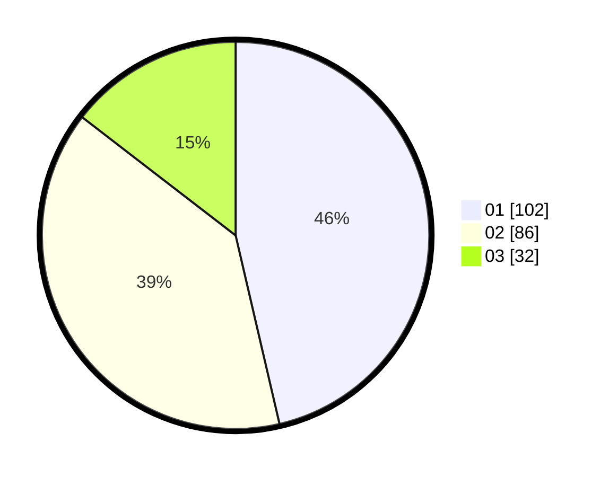

# Hasil

Hasil perolehan suara paslon dapat dilihat pada file paslon-01.txt, paslon-02.txt, dan paslon-03.txt.

Jika tidak ada, artinya data tersebut belum ada pada SIREKAP.

## Perolehan Suara

 * Paslon 01: **102**.
 * Paslon 02: **86**.
 * Paslon 03: **32**.

## Foto C Plano

https://sirekap-obj-formc.kpu.go.id/5141/pemilu/ppwp/31/74/05/10/02/3174051002017-20240217-203241--e589dc58-0edb-4706-82d6-8a78a905e74d.jpg

https://sirekap-obj-formc.kpu.go.id/5141/pemilu/ppwp/31/74/05/10/02/3174051002017-20240217-203321--3e17efa7-02e3-47e0-91b7-d234faa4ba1e.jpg

https://sirekap-obj-formc.kpu.go.id/5141/pemilu/ppwp/31/74/05/10/02/3174051002017-20240217-203401--c0ab0dbc-afe3-44da-a284-2e84e34f1e73.jpg

## DATA PEMILIH TETAP

Jumlah pemilih dalam DPT: **729**.
 * L: **212**.
 * P: **575**.

## DATA PENGGUNA HAK PILIH

Jumlah pengguna hak pilih dalam DPT: **213**.
 * L: **92**.
 * P: **171**.

Jumlah pengguna hak pilih dalam DPTb: **870**.
 * L: **555**.
 * P: **807**.

Jumlah pengguna hak pilih dalam DPK: **3**.
 * L: **1**.
 * P: **404**.

Jumlah pengguna hak pilih: **225**.
 * L: **55**.
 * P: **335**.

## JUMLAH SUARA SAH DAN TIDAK SAH

JUMLAH SELURUH SUARA SAH: **22**.

JUMLAH SUARA TIDAK SAH: **5**.

JUMLAH SELURUH SUARA SAH DAN SUARA TIDAK SAH: **25**.
