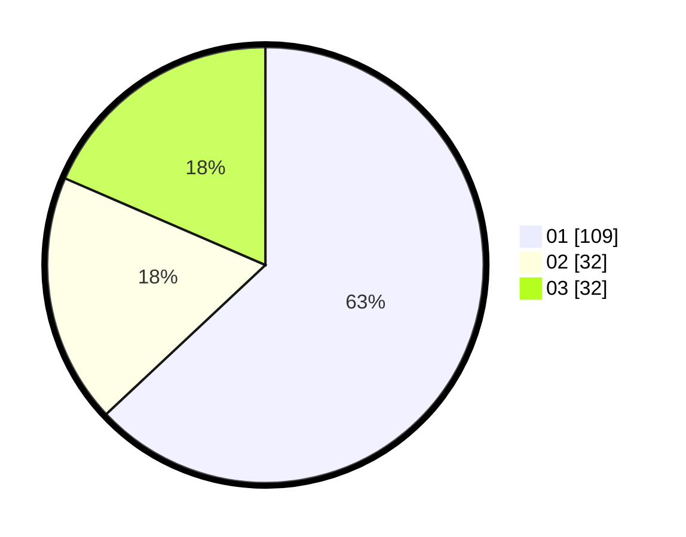

# Hasil

Hasil perolehan suara paslon dapat dilihat pada file paslon-01.txt, paslon-02.txt, dan paslon-03.txt.

Jika tidak ada, artinya data tersebut belum ada pada SIREKAP.

## Perolehan Suara

 * Paslon 01: **109**.
 * Paslon 02: **32**.
 * Paslon 03: **32**.

## Foto C Plano

https://sirekap-obj-formc.kpu.go.id/fa63/pemilu/ppwp/31/74/05/10/02/3174051002018-20240217-210704--bea605ad-0f6a-4ab8-869a-46fd9dc8c623.jpg

https://sirekap-obj-formc.kpu.go.id/fa63/pemilu/ppwp/31/74/05/10/02/3174051002018-20240217-210806--4991ae6b-63b6-4d4e-9c54-25a0812a8497.jpg

https://sirekap-obj-formc.kpu.go.id/fa63/pemilu/ppwp/31/74/05/10/02/3174051002018-20240217-211028--aa48f202-af9a-4ab0-ab84-e619ee8ef2be.jpg

## DATA PEMILIH TETAP

Jumlah pemilih dalam DPT: **278**.
 * L: **133**.
 * P: **145**.

## DATA PENGGUNA HAK PILIH

Jumlah pengguna hak pilih dalam DPT: **223**.
 * L: **109**.
 * P: **119**.

Jumlah pengguna hak pilih dalam DPTb: **10**.
 * L: **405**.
 * P: **5**.

Jumlah pengguna hak pilih dalam DPK: **0**.
 * L: **0**.
 * P: **0**.

Jumlah pengguna hak pilih: **233**.
 * L: **109**.
 * P: **224**.

## JUMLAH SUARA SAH DAN TIDAK SAH

JUMLAH SELURUH SUARA SAH: **233**.

JUMLAH SUARA TIDAK SAH: **20**.

JUMLAH SELURUH SUARA SAH DAN SUARA TIDAK SAH: **233**.
