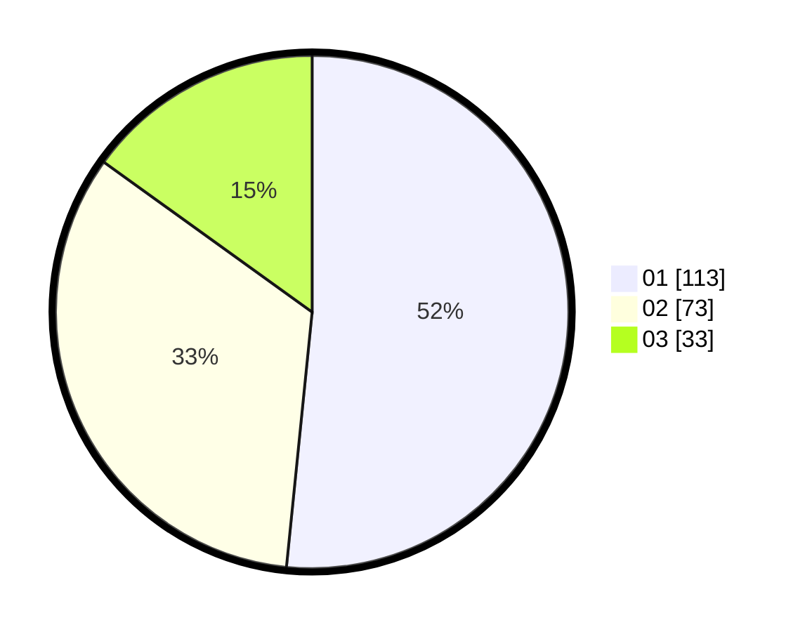

# Hasil

Hasil perolehan suara paslon dapat dilihat pada file paslon-01.txt, paslon-02.txt, dan paslon-03.txt.

Jika tidak ada, artinya data tersebut belum ada pada SIREKAP.

## Perolehan Suara

 * Paslon 01: **113**.
 * Paslon 02: **73**.
 * Paslon 03: **33**.

## Foto C Plano

https://sirekap-obj-formc.kpu.go.id/a686/pemilu/ppwp/31/74/05/10/02/3174051002019-20240218-150205--5d538851-da3c-4e76-97d8-b9f529386651.jpg

https://sirekap-obj-formc.kpu.go.id/a686/pemilu/ppwp/31/74/05/10/02/3174051002019-20240218-150244--29e712af-3353-4a85-b59b-751b8db326e3.jpg

https://sirekap-obj-formc.kpu.go.id/a686/pemilu/ppwp/31/74/05/10/02/3174051002019-20240218-150426--4ac9aada-1dec-4f86-978a-6f57efab04f7.jpg

## DATA PEMILIH TETAP

Jumlah pemilih dalam DPT: **253**.
 * L: **126**.
 * P: **127**.

## DATA PENGGUNA HAK PILIH

Jumlah pengguna hak pilih dalam DPT: **214**.
 * L: **103**.
 * P: **111**.

Jumlah pengguna hak pilih dalam DPTb: **8**.
 * L: **7**.
 * P: **1**.

Jumlah pengguna hak pilih dalam DPK: **3**.
 * L: **1**.
 * P: **2**.

Jumlah pengguna hak pilih: **225**.
 * L: **111**.
 * P: **114**.

## JUMLAH SUARA SAH DAN TIDAK SAH

JUMLAH SELURUH SUARA SAH: **219**.

JUMLAH SUARA TIDAK SAH: **6**.

JUMLAH SELURUH SUARA SAH DAN SUARA TIDAK SAH: **225**.
